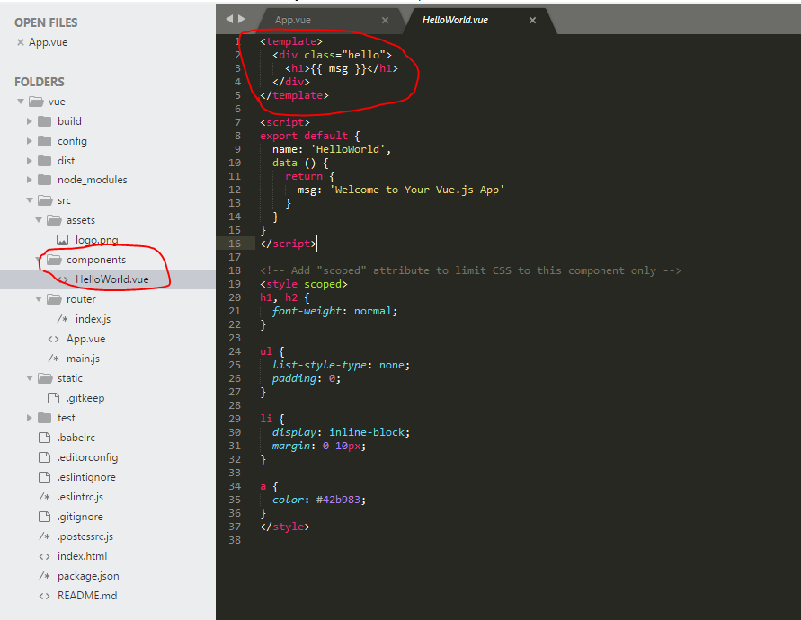
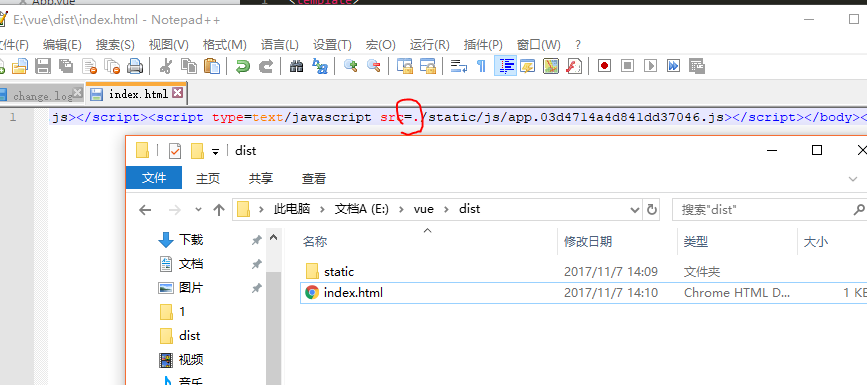

总操作流程：
- 1、[修改vue文件](#vue.js-01)
- 2、[打包](#vue.js-02)
- 3、[修改inde.html文件](#vue.js-03)

[](https://github.com/lidekai/vue.git)

----------
## 修改vue文件 <a name="vue.js-01" href="#" ></a>



## 打包 <a name="vue.js-02" href="#" ></a>

```shell
cnpm run build
```
## 修改inde.html文件 <a name="vue.js-03" href="#" ></a>

`在四个/state  前面都加个.`

