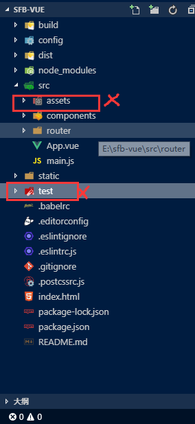
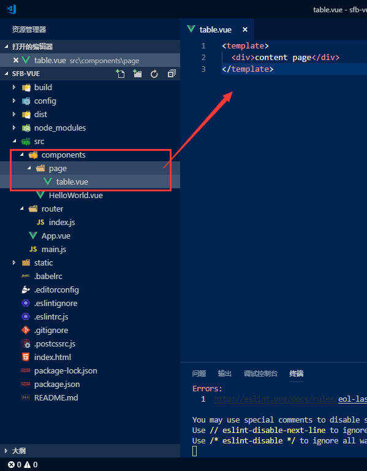
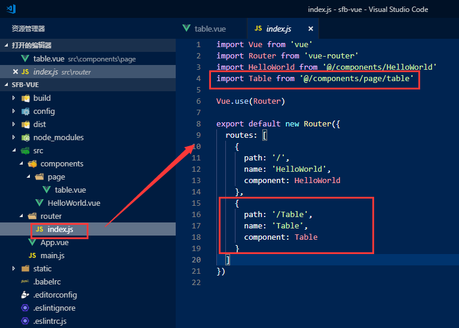

总操作流程：
- 1、[删除内容和文件](#vue.js-01)
- 2、[创建文件](#vue.js-02)
- 3、[修改路由](#vue.js-03)
- 4、[看效果](#vue.js-04)

***

## 删除内容和文件 <a name="vue.js-01" href="#" >:house:</a>

> 1、创建vue项目

[](/前端/Vue.js/01.02.Vue.js之搭建项目.md)

`注意：服务器启动后不用关掉，代码修改后，直接可以在http://localhost:8080/查看`

> 2、删除App.vue文件的内容

- 改后效果

<details>
<summary>代码</summary>

```html
<template>
  <div id="app">
    <router-view/>
  </div>
</template>

<script>
export default {
  name: 'App'
}
</script>

<style>

</style>

```

</details>

> 3、删除vue项目文件




## 创建文件 <a name="vue.js-02" href="#" >:house:</a>

> 1、创建新的vue文件



> 2、创建Table.vue

<details>
<summary>代码</summary>


```html
<template>
  <div>{{test}}</div>
</template>
<script>
export default {
  name: 'Table',
  data () {
    return {
      test: '1111111111111111'
    }
  }
}
</script>

<style scoped>

</style>
```

</details>

> 3、修改HelloWorld.vue

<details>
<summary>代码</summary>


```html
<template>
  <div class="hello">
    <h1>{{ msg }}</h1>
  </div>
</template>

<script>
export default {
  name: 'HelloWorld',
  data () {
    return {
      msg: 'Welcome to Your Vue.js App'
    }
  }
}
</script>

<style scoped>

</style>

```

</details>

## 修改路由 <a name="vue.js-03" href="#" >:house:</a>



<details>
<summary>代码</summary>

```js
import Vue from 'vue'
import Router from 'vue-router'
import HelloWorld from '@/components/HelloWorld'
import Table from '@/components/page/table'

Vue.use(Router)

export default new Router({
  routes: [
    {
      path: '/',
      name: 'HelloWorld',
      component: HelloWorld
    },
    {
      path: '/Table',
      name: 'Table',
      component: Table
    }
  ]
})
```

</details>

## 看效果 <a name="vue.js-04" href="#" >:house:</a>

```shell
http://localhost:8080/#/Table
```


