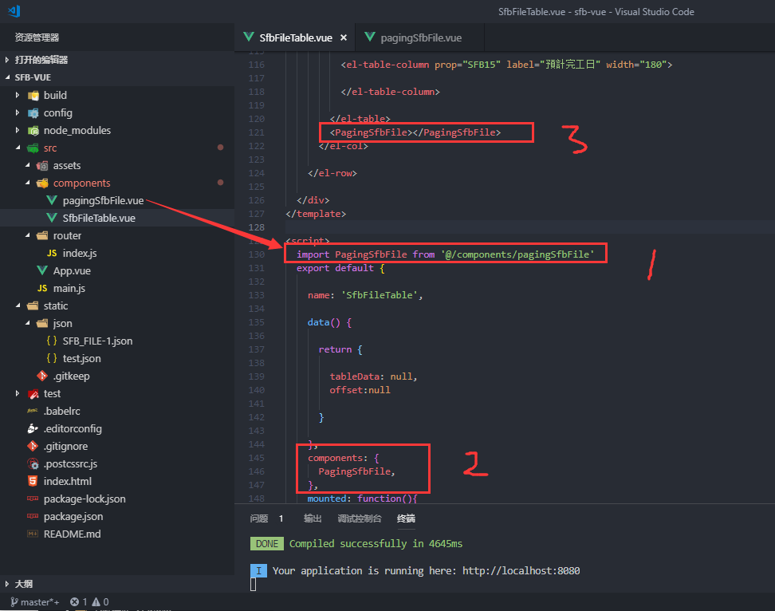
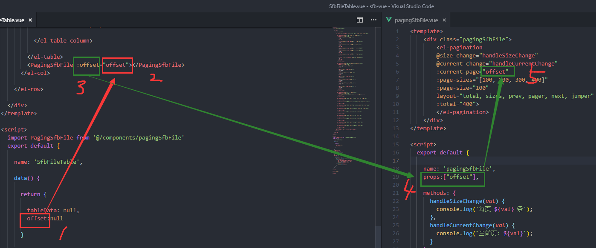
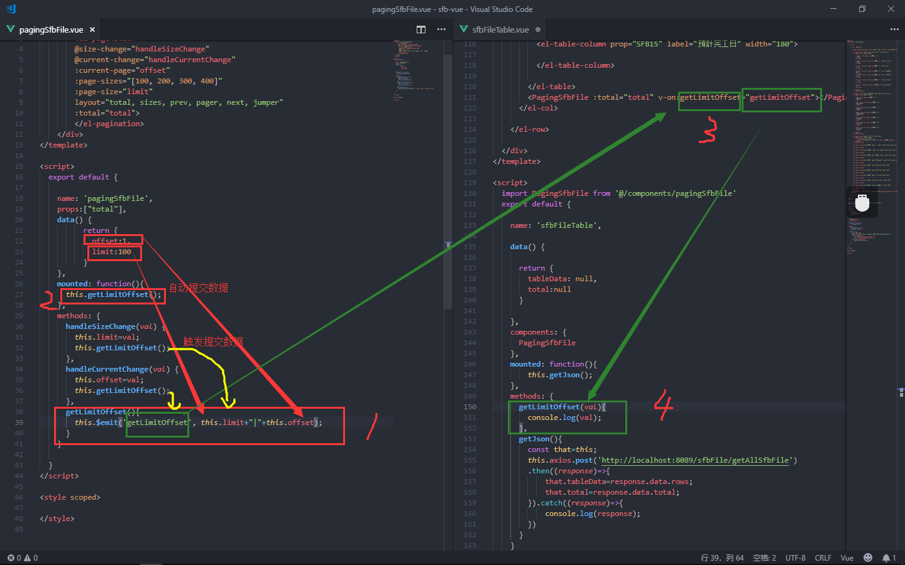

总操作流程：
- 1、[在父文件的引用组件](#vue.js-01)
- 2、[数据传输](#vue.js-02)
- 3、[看效果](#vue.js-03)

***

## 在父组件的引用子组件 <a name="vue.js-01" href="#" >:house:</a>



## 数据传输 <a name="vue.js-02" href="#" >:house:</a>

> 1、父组件向子组件进行传值 (props)



> 2、子组件向父组件传值




## 看效果 <a name="vue.js-03" href="#" >:house:</a>

```
运行看效果
```