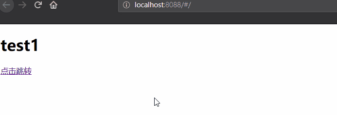
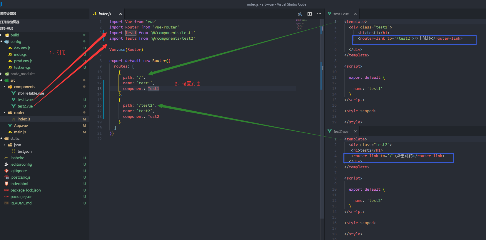
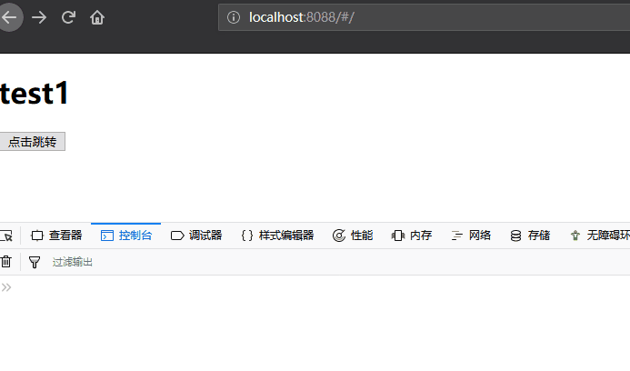
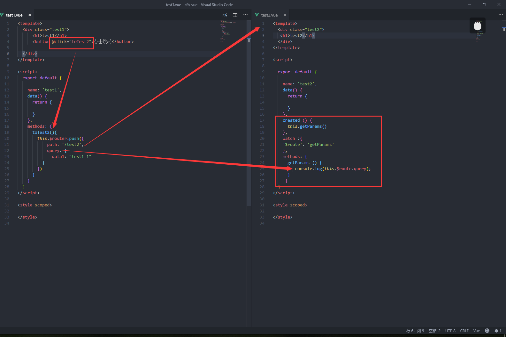

本页目录：
- 1、[不带参数跳转](#vue.js-01)
- 2、[带参数跳转](#vue.js-02)

***

## 不带参数跳转 <a name="vue.js-01" href="#" >:house:</a>

### 效果

### 代码

## 带参数跳转 <a name="vue.js-02" href="#" >:house:</a>

- 该跳转，刷新页面，参数不失效

### 效果

### 代码

>路由设置还是以上的一样

