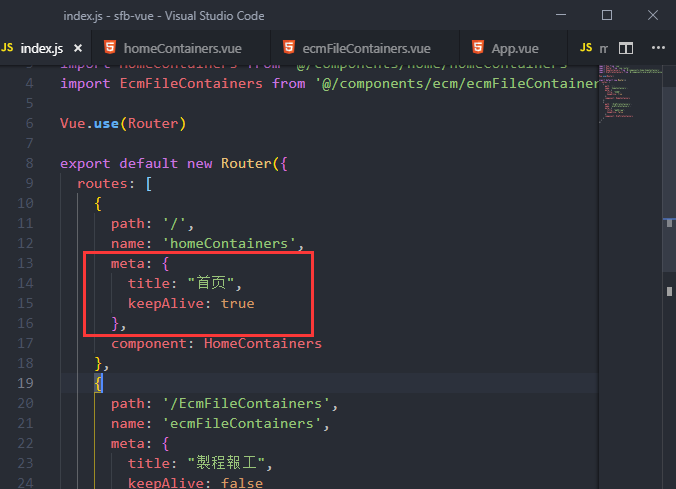

总操作流程：
- 1、[安装](#vue.js-01)
- 2、[修改代码](#vue.js-02)
- 3、[看效果](#vue.js-03)

*** 

## 安装 <a name="vue.js-01" href="#" >:house:</a>

```shell
cnpm install vue-wechat-title --save
```

## 修改代码 <a name="vue.js-02" href="#" >:house:</a>

>1、main.js
```js
import VueWechatTitle from 'vue-wechat-title'

Vue.use(VueWechatTitle)
```

>2、路由js

```js
meta: { 
        title: "首页",
        keepAlive: true 
      },
```



> 3、App.vue
```js
<router-view v-wechat-title='$route.meta.title'/>
```

## 看效果 <a name="vue.js-03" href="#" >:house:</a>

运行看效果