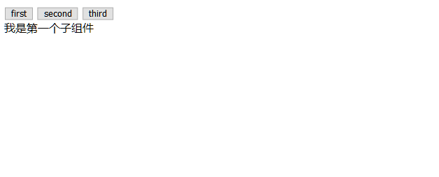

总操作流程：
- 1、[写程序](#vue.js-01)
- 2、[测试](#vue.js-02)

***

## 写程序 <a name="vue.js-01" href="#" >:house:</a>

> 1、修改路由

<details>
<summary>代码</summary>

```js
import Vue from 'vue'
import Router from 'vue-router'
import Test from '@/components/test'


Vue.use(Router)

export default new Router({
    routes: [{
        path: '/',
        name: 'Test',
        component: Test
    }]
})
```

</details>

> 2、test.vue

<details>
<summary>代码</summary>

```html
<template>
  <div>
      <button @click="toggleTabs(first);">{{first}}</button>
      <button @click="toggleTabs(second);">{{second}}</button>
      <button @click="toggleTabs(third);">{{third}}</button>
      <component :is="currentView"></component>
  </div>

</template>

<script>
import first from '@/components/first';
import second from '@/components/second';
import third from '@/components/third';
export default {
        data () {
             return {
              first: "first", 
              second: "second",
              third: "third",
              currentView: 'first',
             };
         },
         components: { 
             first,
             second,
             third
         },
         methods: {
             toggleTabs (tabText) {
                 this.currentView = tabText;
             }
         }
    }
</script>


<style scoped>

</style>

```

</details>

> 3、first.vue

<details>
<summary>代码</summary>

```html
<template>
    <div>我是第一个子组件</div>
</template>

<script >

</script>

<style scoped>

</style>
```

</details>

> 4、second.vue

<details>
<summary>代码</summary>

```html
<template>
    <div>我是第二个子组件</div>
</template>

<script>

</script>

<style scoped>

</style>
```

</details>

> 5、third

<details>
<summary>代码</summary>

```html
<template>
    <div>我是第三个子组件</div>
</template>

<script>

</script>

<style scoped>

</style>
```

</details>

## 测试 <a name="vue.js-02" href="#" >:house:</a>

