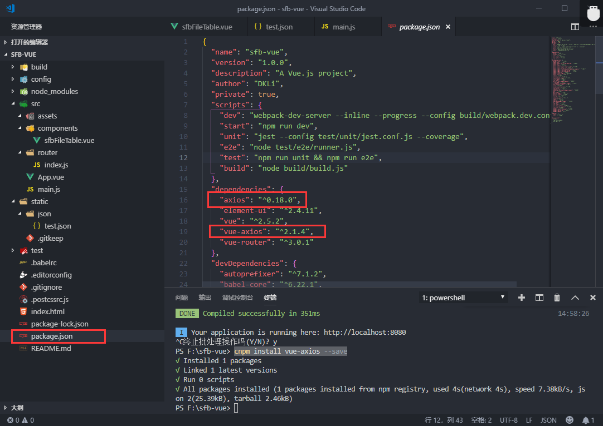
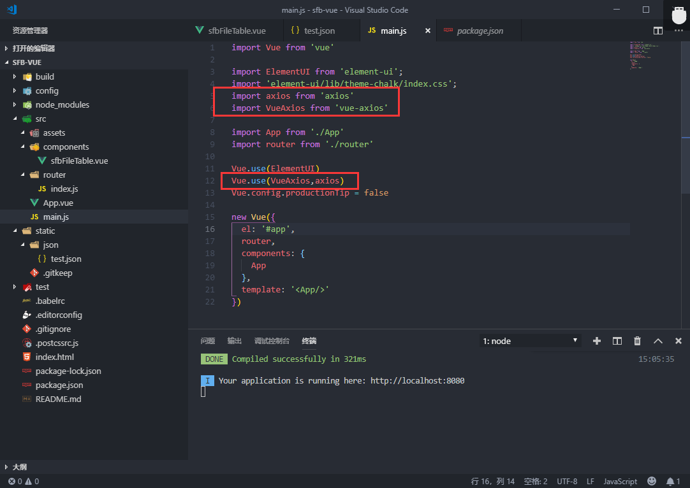
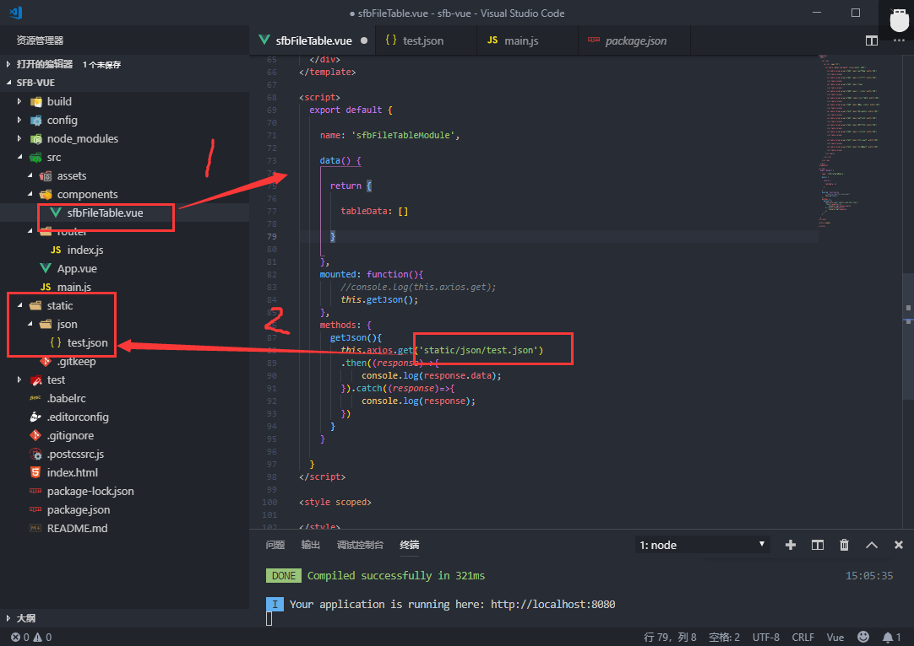
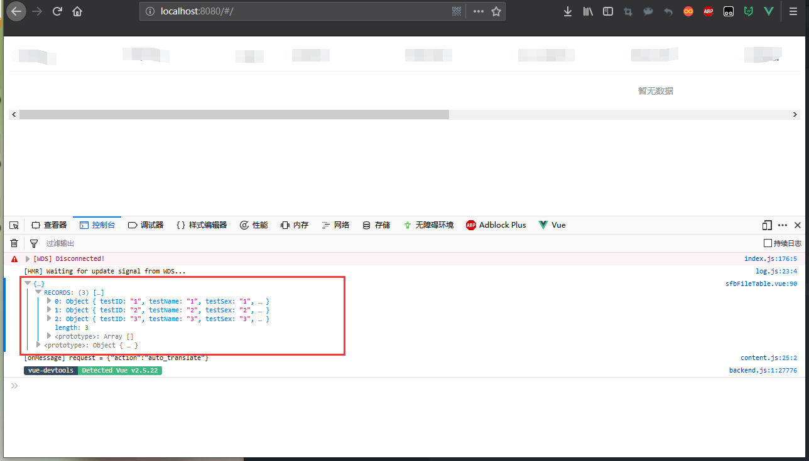

总操作流程：
- 1、[下载安装](#vue.js-01)
- 2、[引用使用](#vue.js-02)
- 3、[看效果](#vue.js-03)

***

- 注意：该教程结合vue-axios使用

## 下载安装 <a name="vue.js-01" href="#" >:house:</a>

>1、开启的服务器，要退出

```
快捷键：Ctrl+C
```

> 2、下载安装

```shell
npm install axios --save
npm install vue-axios --save

#或者

yarn add axios 
yarn add vue-axios
```

- 成功标志




## 引用使用 <a name="vue.js-02" href="#" >:house:</a>

 >1、在main.js中引用，在App上导入

 ```js
import axios from 'axios'
import VueAxios from 'vue-axios'
 ```

 ```js
 Vue.use(VueAxios,axios)
 ```



 - 2、组件中使用（这是访问本地json的）



<details>
<summary>代码</summary>


```js
<script>
  export default {
  
    name: 'sfbFileTableModule',
  
    data() {
  
      return {
  
        tableData: []
  
      }
  
    },
    mounted: function(){
        //console.log(this.axios.get);
        this.getJson();
    },
    methods: {
      getJson(){
        this.axios.get('static/json/test.json')
        .then((response)=>{
            console.log(response.data);
        }).catch((response)=>{
            console.log(response);
        })
      }
    }
  
  }
</script>
```

</details>

>json格式(例子)

<details>
<summary>代码</summary>

```json
{
    "code":"OK",
    "msg":"成功",
    "time":"2019-01-02",
    "offset":0,
    "page":1,
    "limit":10,
    "total":84,
    "rows": [
        
    ]
}
```

</details>

>访问后台的

<details>
<summary>代码</summary>

```js
const that = this;
        this.axios({
            method: "post",
            headers: {
              'Content-Type': 'application/json'
            },
            transformRequest: [function (data) {
              data = JSON.stringify(data)
              return data
            }],
            url: 'http://localhost:8089/user/getUserPage',
            data: {
              //start: that.start,
              //end: that.end
            }
          })
          .then((response) => {
            //let userJson = JSON.parse(JSON.stringify(response.data.rows));
            //that.userTableData = userJson;
            //that.total = response.data.total;

          }).catch((response) => {
            console.log(response);
          });
```

</details>

## 看效果 <a name="vue.js-03" href="#" >:house:</a>


