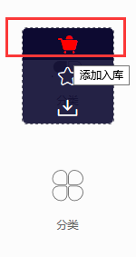
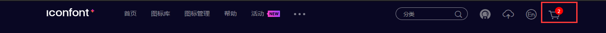
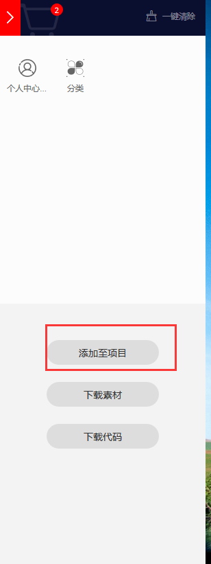
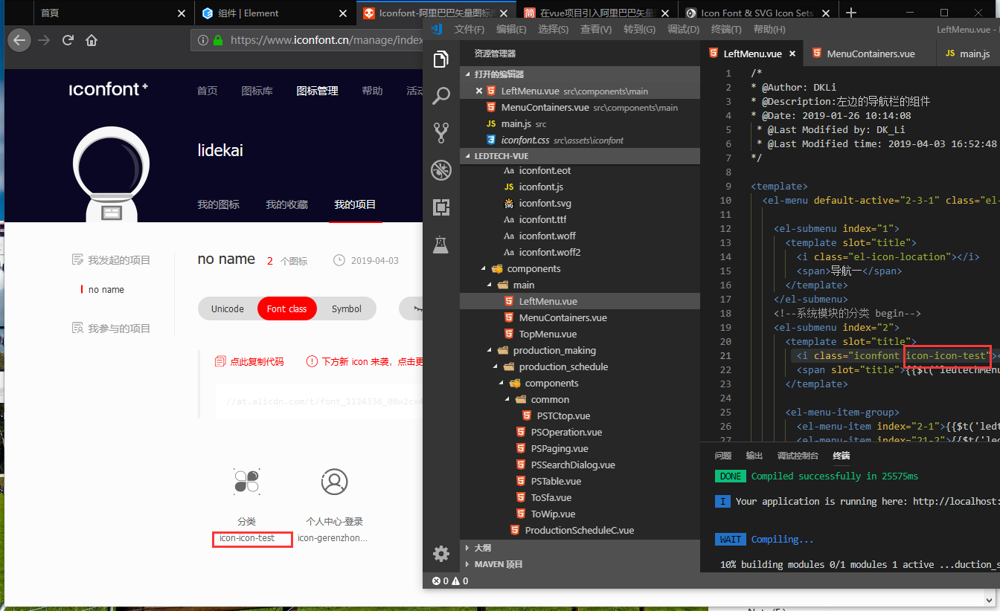
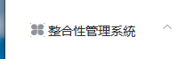

总操作流程:
- 1、[下载图标包](#vue.js-01)
- 2、[写代码](#vue.js-02)
- 3、[看效果](#vue.js-03)

***

## 下载图标包 <a name="vue.js-01" href="#" >:house:</a>

[](https://www.iconfont.cn/manage/index?manage_type=myprojects&projectId=1124336)








## 写代码 <a name="vue.js-02" href="#" >:house:</a>


- 注意：下载解压后，html文件是个使用说明书，里面有三种引用方式

> 1、导入文件

- 将下载好的文件放到：static\icon下

- 在main.js引用：import '../static/icon/iconfont.css'


> 2、写代码

```js
 <i class="iconfont icon-icon-test"></i>
```



## 看效果 <a name="vue.js-03" href="#" >:house:</a>

