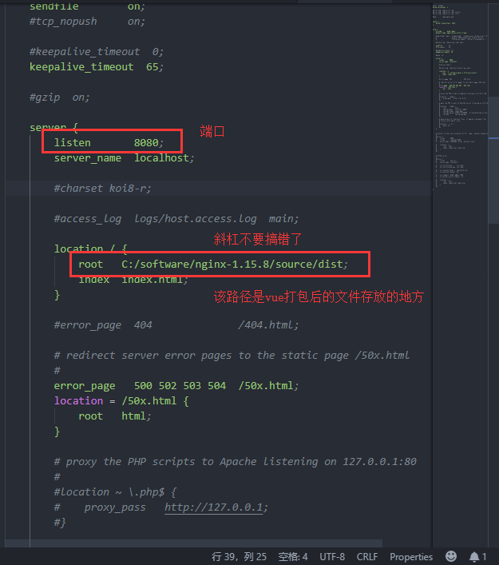

总操作流程：
- 1、[下载解压配置nginx](#vue.js-01)
- 2、[vue项目打包部署](#vue.js-02)
- 3、[看效果](#vue.js-03)

***

## 下载解压配置nginx <a name="vue.js-01" href="#" >:house:</a>

> 1、下载

[](http://nginx.org/en/docs/windows.html)

>2、修改配置文件 nginx-1.15.8\conf\nginx.conf



- 配置跨域，为后台交接数据做准备。+是标识跨域需要的部分，运行代码去掉+号

```diff
    server {
        listen       81;
        server_name  localhost;

        #charset koi8-r;

        #access_log  logs/host.access.log  main;

        location / {
            # 代码的路径指定处
            root   /usr/local/nginx/source/html/dist;
            index  index.html;

+	    add_header Access-Control-Allow-Origin *;
+            add_header Access-Control-Allow-Methods 'GET, POST, OPTIONS';
+            add_header Access-Control-Allow-Headers 'DNT,X-Mx-ReqToken,Keep-Alive,User-Agent,X-Requested-With,If-Modified-Since,Cache-Control,Content-Type,Authorization';

+            if ($request_method = 'OPTIONS') {
+                return 204;
+            }
+        }
```

## vue项目打包部署 <a name="vue.js-02" href="#" >:house:</a>

[](/前端/Vue.js/01.03.Vue.js之打包.md)

## 看效果 <a name="vue.js-03" href="#" >:house:</a>

> cmd进入nginx目录运行命令
```shell
start nginx #启动
```

浏览器进入配置好的IP和端口


> 其他命令
```shell
nginx -s quit #停止命令
nginx -s reload #重启命令
```