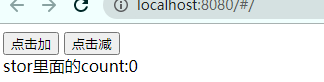

总操作流程：
- 1、[安装](#vue.js-01)
- 2、[写代码](#vue.js-02)
- 3、[测试](#vue.js-03)

***

## 安装 <a name="vue.js-01" href="#" ></a>

```shell
npm install vuex --save
npm install vuex-persistedstate --save
# 或者
yarn add vuex
yarn add vuex-persistedstate
```
## 写代码 <a name="vue.js-02" href="#" ></a>

> 创建文件src\store\index.js

```js
import Vue from 'vue'
import Vuex from 'vuex'
import persistedState from 'vuex-persistedstate';
Vue.use(Vuex)
export default new Vuex.Store({
  plugins: [persistedState()],
  state: {//设置属性 用来存储数据
    count: 0
  },
  mutations: {//定义的修改 属性的方法
    add(state, n) {
      state.count += n
    },
    reduce(state, n) {
      state.count -= n
    }
  }
})
```

> main.js引用

```js
import store from '@/store'
```

```diff
new Vue({
   el: '#app',
+  store,
   router,
   components: {
     App
   },
   template: '<App/>'
})
```

> 展现代码

```vue
<template>
  <div class="HelloWorld">
    <button @click="add(2)">点击加</button>
    <button @click="reduce(1)">点击减</button>
    <div>stor里面的count:{{count}}</div>
  </div>
</template>

<script>
  import {mapState,mapMutations} from 'vuex'
  export default {
    name: 'HelloWorld',
    data() {
      return {
      }
    },
    computed: {
      ...mapState(["count"]),
      
    },
    methods: {
      ...mapMutations(['add', 'reduce'])
    }
  }

</script>

<style scoped>
</style>

```

## 测试 <a name="vue.js-03" href="#" ></a>

> 运行

```shell
npm run dev
# 或者
yarn run dev
```

> 测试：刷新页面数据依旧不改变，只用清除cookie再刷新才将数据归初始


