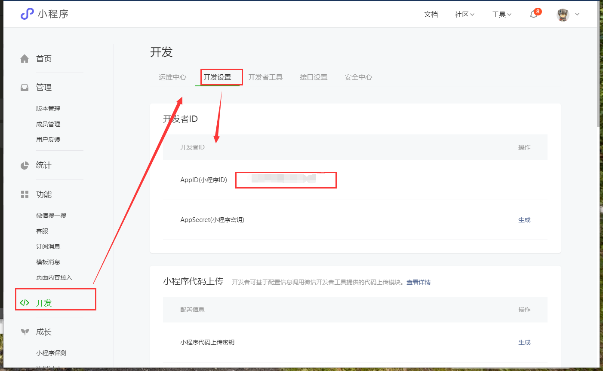

总操作流程：
- 1、[下载安装](#uniApp-01)
- 2、[配置](#uniApp-02)
- 3、[运行](#uniApp-03)

***

## 下载安装 <a name="uniApp-01" href="#" >:house:</a>

> 全局安装 vue-cli 3.x

```shell
# 运行cmd，执行命令
cnpm install -g @vue/cli

# npm 设置淘宝源，检测是否成功：npm config get registry 
npm config set registry https://registry.npm.taobao.org
```

> 创建项目

- 创建uni-app(正式版)

```shell
# vs code打开终端，执行命令
vue create -p dcloudio/uni-preset-vue test
```

- 一般下载“默认版本”进行开发，“hello uni-app版本”用来参考获取组件源代码


> 安装组件语法提示

```
cnpm i @dcloudio/uni-helper-json
```

## 配置 <a name="uniApp-02" href="#" >:house:</a>

> 导入 HBuilderX 自带的代码块

[](https://github.com/zhetengbiji/uniapp-snippets-vscode)

- 放到项目目录下的 .vscode 目录


## 运行 <a name="uniApp-03" href="#" >:house:</a>

> 运行项目

```shell
# 语法:cnpm run dev:%PLATFORM%
cnpm run dev:mp-weixin
```

- %PLATFORM% 可取值如下：

| 值 | 平台 |
| :-: | :-: |
| H5 | H5 |
| mp-alipay | 支付宝小程序 |
| mp-baidu | 百度小程序 |
| mp-weixin | 微信小程序 |
| mp-toutiao | 头条小程序 |
| mp-qq	qq | 小程序 |

> 微信小程序导入项目看效果

- 获取小程序ID

[](https://mp.weixin.qq.com/)



- 导入项目


- 效果


