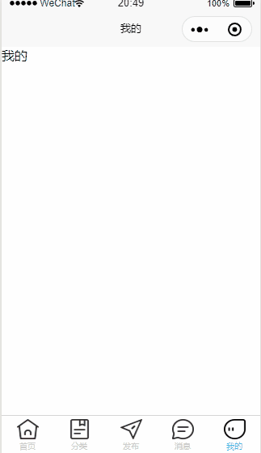

总操作流程
- 1、[看效果](#uniApp-01)
- 2、[写代码](#uniApp-02)
- 3、[运行](#uniApp-03)

***

## 看效果 <a name="uniApp-01" href="#" >:house:</a>



## 写代码 <a name="uniApp-02" href="#" >:house:</a>

> 下载矢量图(.png格式)

[](https://www.iconfont.cn/manage/index?manage_type=myprojects&projectId=1124336)

- 将下载好的图片放到static/image文件夹下

> 创建vue(以home.vue为例，其他的vue一样的格式)

```vue
<template>
	<h1>首页</h1>
</template>

<script>

</script>

<style>

</style>

```

> 修改pages.json

[](https://uniapp.dcloud.io/collocation/pages?id=tabbar)

<details>
<summary>代码</summary>

```json
{
	"pages": [
	    {
	        "path": "pages/home/home",
	        "style": {
	        	"navigationBarTitleText": "首页"
	        }
	    },
		{
            "path" : "pages/classes/classes",
            "style" : {
				"navigationBarTitleText": "分类"
			}
        },
		{ 
		    "path" : "pages/publish/publish",
		    "style" : {
				"navigationBarTitleText": "发布"
			}
		},
		{
		    "path" : "pages/news/news",
		    "style" : {
				"navigationBarTitleText": "消息"
			}
		},
        {
            "path" : "pages/me/me",
            "style" : {
				"navigationBarTitleText": "我的"
			}
        }
    ],
	"tabBar": {
			"color": "#cdcdcd",
		    "selectedColor": "#39cffc",
		    "borderStyle": "black",
		    "backgroundColor": "#ffffff",
	        "list": [
				{
	                "pagePath": "pages/home/home",
	                "iconPath": "static/image/home.png",
	                "selectedIconPath": "static/image/home.png",
					"text": "首页"
	            }, 
				{
				    "pagePath": "pages/classes/classes",
				    "iconPath": "static/image/classes.png",
				    "selectedIconPath": "static/image/classes.png",
					"text": "分类"
				}, 
				{
				    "pagePath": "pages/publish/publish",
				    "iconPath": "static/image/publish.png",
				    "selectedIconPath": "static/image/publish.png",
					"text": "发布"
				}, 
				{
				    "pagePath": "pages/news/news",
				    "iconPath": "static/image/news.png",
				    "selectedIconPath": "static/image/news.png",
					"text": "消息"
				}, 
				{
				    "pagePath": "pages/me/me",
				    "iconPath": "static/image/me.png",
				    "selectedIconPath": "static/image/me.png",
					"text": "我的"
				}
	        ]
	    },
	"globalStyle": {
		"navigationBarTextStyle": "black",
		"navigationBarTitleText": "DKLi",
		"navigationBarBackgroundColor": "#F8F8F8",
		"backgroundColor": "#F8F8F8"
	}
}
```

</details>

## 运行 <a name="uniApp-03" href="#" >:house:</a>

> 运行命令

```shell
cnpm run dev:mp-weixin
```
