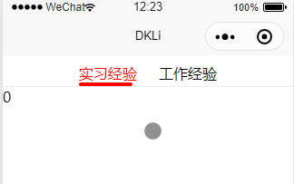

本页目录
- 1、效果展现
- 2、代码

***

## 效果展现



## 代码

<details>
<summary>代码</summary>

```vue
<!--
 * @Descripttion: 
 * @version: 0.1
 * @Author: DK_Li
 * @Date: 2020-03-28 17:36:51
 * @LastEditors: DK_Li
 * @LastEditTime: 2020-03-30 12:24:58
 -->
 <template>
	<view>
		<!-- 顶部导航栏 -->
		<view class="horizonal-tab">
			<scroll-view scroll-x="true" scroll-with-animation class="scroll-tab">
				<block v-for="(item,index) in tabBars" :key="index">
					<view class="scroll-tab-item" :class="{'active': tabIndex==index}" @tap="toggleTab(index)">
						{{item}}
						<view class="scroll-tab-line"></view>
					</view>
				</block>
			</scroll-view>
		</view>

		<!-- 内容区 -->
		<view class="content">
			<swiper :current="tabIndex" @change="tabChange">
				<swiper-item v-for="(content,index) in tabBars" :key="index">
					{{index}}
				</swiper-item>
			</swiper>
		</view>
	</view>
</template>

<script>
	export default {
		data() {
			return {
				tabIndex: 0,
				tabBars: ['实习经验','工作经验']
			}
		},
		methods: {
			//切换选项卡
			toggleTab(index) {
				this.tabIndex = index;
			},
			//滑动切换swiper
			tabChange(e) {
				this.tabIndex = e.detail.current;	
			}
		}
	}
</script>

<style>
	.horizonal-tab .active {
		color: red;
	}

	.scroll-tab {
		white-space: nowrap;
		border-bottom: 1rpx solid #eee;
		text-align: center;
	}

	.scroll-tab-item {
		display: inline-block;
		margin: 20rpx 30rpx 0 30rpx;
	}

	.active .scroll-tab-line {
		border-bottom: 5rpx solid red;
		border-top: 5rpx solid red;
		border-radius: 20rpx;
		width: 140rpx;

	}
</style>
```

</details>