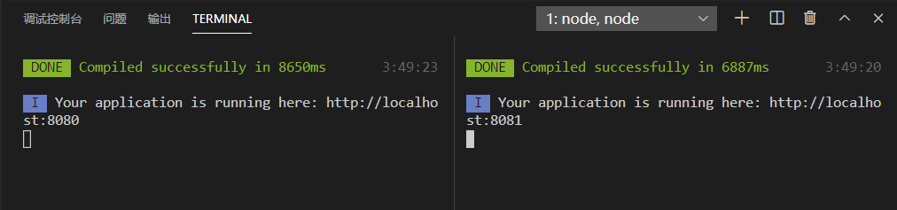
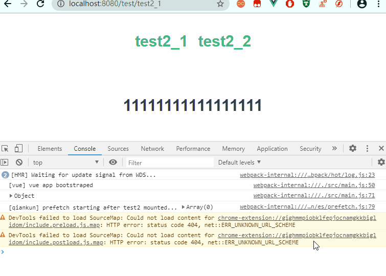

[](https://qiankun.umijs.org/zh)

[](https://segmentfault.com/a/1190000021547996)

总操作流程：
- 1、[创建主应用](#qiankun-01)
- 2、[创建子应用](#qiankun-02)
- 3、[测试](#qiankun-03)

***

## 创建主应用 <a name="qiankun-01" href="#" >:house:</a>

> 使用webpack创建vue主项目：test1

```
vue init webpack test1
```

- [](/前端/Vue.js/01.02.Vue.js之搭建项目.md)

> 安装插件

```shell

cd test1

cnpm i vuex --save
cnpm i vuex-persistedstate --save
cnpm i qiankun --save

# 或者
yarn add vuex
yarn add vuex-persistedstate
yarn add qiankun
```

> 写代码

<details>
<summary>router\index.js</summary>

```js
import Vue from 'vue'
import Router from 'vue-router'

Vue.use(Router)

export default new Router({
  mode: 'history',
  base: process.env.BASE_URL
})
```

</details>

<details>
<summary>store\index.js</summary>

```js
import Vue from 'vue'
import Vuex from 'vuex'
import persistedState from 'vuex-persistedstate';

Vue.use(Vuex)

export default new Vuex.Store({
  plugins: [persistedState()],
  state: {
    content: '',
  },
  mutations: {
    changeCenter(state, params) {
      state.content = params;
    }
  },
})

```

</details>

<details>
<summary>main.js</summary>

```js
import Vue from 'vue'
import App from './App'
import router from './router'
import store from './store'
import {
  registerMicroApps,
  setDefaultMountApp,
  start
} from 'qiankun';

Vue.config.productionTip = false

let app = null;

render({})

function render({
  appContent
}) {
  if (!app) {
    app = new Vue({
      el: '#app',
      router,
      store,
      components: {
        App
      },
      template: '<App/>'
    })
  } else {
    store.commit('changeCenter', appContent);
  }
}

//注册微应用
registerMicroApps([{
  name: 'test2',
  entry: '//localhost:8081',//子应用的端口
  container: '#container',//App.vue的切换应用的id
  activeRule: '/test',
}]);


//设置主应用启动后默认进入的微应用
setDefaultMountApp('/test/test2_1')

start({
  sandbox: {
    strictStyleIsolation: true //开启严格的样式隔离模式
  }
})
```

</details>

<details>
<summary>App.vue</summary>

```vue
<template>
  <div id="app">
    <div id="nav">
      
      <div @click="onChangePage('/test/test2_1')" >test2_1</div>
      <div @click="onChangePage('/test/test2_2')" >test2_2</div>
   
    </div>
     <div id="container" v-html="content"></div>
  </div>
</template>

<script>
import { mapState } from 'vuex';
  export default{
    data(){
      return {
     
      }
    },
    computed:{
       ...mapState(['content']),
    },

    methods:{
      onChangePage(url){
        console.log(url)
        this.routerGo(url, 'test')
      },
  
      routerGo(href = '/', title = null, stateObj = {}) {
        window.history.pushState(stateObj, title, href); 
      },
    }
  }
</script>

<style>
#app {
  font-family: Avenir, Helvetica, Arial, sans-serif;
  -webkit-font-smoothing: antialiased;
  -moz-osx-font-smoothing: grayscale;
  text-align: center;
  color: #2c3e50;
}

#nav {
  padding: 30px;
  display: flex;
  justify-content: center;
}
#nav > div {
    margin: 0 10px;
    font-weight: bold;
    font-size:30px;
    color: #42b983;
  
  }
</style>
```

</details>

# <a name="qiankun-02" href="#" >创建子应用:house:</a>

> 使用webpack创建vue子项目：test2

```
vue init webpack test2
```

> 写代码

- 创建组件：test2_1

<details>
<summary>views\Test2_1.vue</summary>

```vue
<template>
    <div class="test2_1">
      <h1>{{ msg }}</h1>
    </div>
  </template>
  
  <script>
  export default {
    name: 'Test2_1',
    data () {
      return {
        msg: '11111111111111111'
      }
    }
  }
  </script>
  
  <style scoped>

  </style>
  
```

</details>

- 创建组件：test2_2

<details>
<summary>views\Test2_2.vue</summary>

```vue
<template>
    <div class="test2_2">
      <h1>{{ msg }}</h1>
    </div>
  </template>
  
  <script>
  export default {
    name: 'Test2_2',
    data () {
      return {
        msg: '22222222222222222'
      }
    }
  }
  </script>
  
  <style scoped>

  </style>
  
```

</details>


<details>
<summary>router\index.js</summary>

```js
import Vue from 'vue'
import Router from 'vue-router'
import Test2_1 from '@/views/Test2_1'
import Test2_2 from '@/views/Test2_2'

Vue.use(Router)

export default new Router({
  base: window.__POWERED_kBY_QIANKUN__ ? '/' : '/test',
  mode: 'history',
  routes: [{
      path: '/test2_1',
      name: 'Test2_1',
      component: Test2_1
    },
    {
      path: '/test2_2',
      name: 'Test2_2',
      component: Test2_2
    }
  ]
})

```

</details>

<details>
<summary>main.js</summary>

```js
import Vue from 'vue'
import App from './App'
import router from './router'

Vue.config.productionTip = false


if (!window.__POWERED_BY_QIANKUN__) {
  render();
}

function render(props = {}) {
  const {
    container
  } = props;
  new Vue({
    router,
    render: h => h(App),
  }).$mount(container ? container.querySelector('#app') : '#app');
}

export async function bootstrap() {
  console.log('[vue] vue app bootstraped');
}

export async function mount(props) {
  console.log(props)
  render(props);
}

export async function unmount() {
  instance.$destroy();
}

if (window.__POWERED_BY_QIANKUN__) {
  //处理资源
  __webpack_public_path__ = window.__INJECTED_PUBLIC_PATH_BY_QIANKUN__;
}
```

</details>

> 修改配置文件

- 加入微应用的打包工具配置

<details>
<summary>test2\build\webpack.base.conf.js</summary>

```diff
 output: {
+    library: 'test2',
+    libraryTarget: 'umd',
+    jsonpFunction: 'webpackJsonp_test2',
 }
```

</details>

- 加入跨域配置

<details>
<summary>test2\build\webpack.dev.conf.js</summary>

```diff
devServer: {
+    headers: {
+      'Access-Control-Allow-Origin': '*',
+    },
}

```

</details>

- 修改端口

<details>
<summary>test2\config\index.js</summary>

```diff
dev: {
! port: 8081
}

```

</details>


## 测试 <a name="qiankun-03" href="#" >:house:</a>

> 运行主项目和子项目



> 看效果：

- 浏览器输入地址：http://localhost:8080

