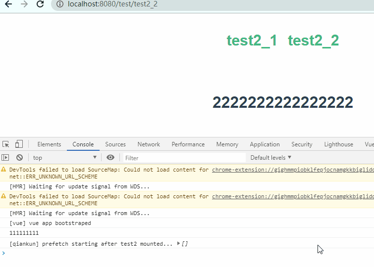

总操作流程：
- 1、[改程序](#qiankun-01)
- 2、[测试](#qiankun-02)

> 本教程基于：qiankun之构建微前端主应用与子应用

***

## 改程序 <a name="qiankun-01" href="#" >:house:</a>

> 修改：test1\src\main.js

```diff
+ let msg = {
+  data: '111111111'
+ }
//注册微应用
registerMicroApps([{
  name: 'test2',
  entry: '//localhost:8081',
  container: '#container',
  activeRule: '/test',
+  props: msg,
}]);

```

> 修改：test2\src\main.js

```diff
export async function mount(props) {
!  console.log(props.data)
  render(props);
}
```

## 测试 <a name="qiankun-02" href="#" >:house:</a>

> 运行主项目和子项目

> 刷新浏览器看效果


