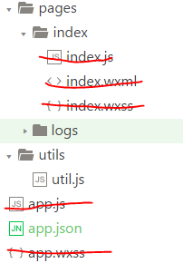
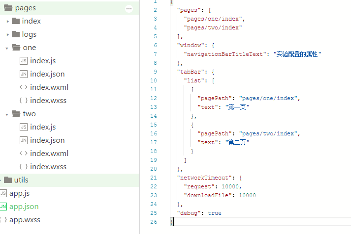

[](https://mp.weixin.qq.com/debug/wxadoc/dev/framework/config.html)


操作总流程：
- 1、清空画了红线文件的数据；



- 2、编写代码

2.1、app.json代码实现

2.2、pages/one/index.wxml代码实现

2.3、pages/two/index.wxml代码实现

----------
## app.json代码实现


```json
{
  "pages": [
    "pages/one/index",
    "pages/two/index"
  ],
  "window": {
    "navigationBarTitleText": "实验配置的属性"
  },
  "tabBar": {
    "list": [
      {
        "pagePath": "pages/one/index",
        "text": "第一页"
      },
      {
        "pagePath": "pages/two/index",
        "text": "第二页"
      }
    ]
  },
  "networkTimeout": {
    "request": 10000,
    "downloadFile": 10000
  },
  "debug": true
}
```
## pages/one/index.wxml代码实现
```wxml
<!--pages/one/index.wxml-->
<text>第一页</text>
```

## pages/two/index.wxml代码实现 
```wxml
<!--pages/two/index.wxml-->
<text>第二页</text>
```