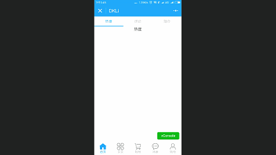
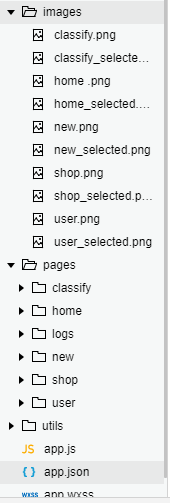

- 效果展现：



- 结构：



- 代码：
## app.json
```json
{
  "pages":[
    "pages/home/home",
    "pages/classify/classify",
    "pages/shop/shop",
    "pages/new/new",
    "pages/user/user",
    "pages/logs/logs"
  ],
 "window": {
  "navigationBarTitleText": "DKLi",
  "navigationBarBackgroundColor": "#1296db"
},
"tabBar": {
  "color": "#989898",
  "selectedColor": "#1296db",
  "borderStyle": "white",
  "backgroundColor":"#fcfbfb",
  "list": [
    {
      "pagePath": "pages/home/home",
      "text": "首页",
      "iconPath":"images/home .png",
      "selectedIconPath":"images/home_selected.png"
    },
    {
      "pagePath": "pages/classify/classify",
      "text": "买买",
      "iconPath": "images/classify.png",
      "selectedIconPath": "images/classify_selected.png"
    },
    {
      "pagePath": "pages/shop/shop",
      "text": "购物",
      "iconPath": "images/shop.png",
      "selectedIconPath": "images/shop_selected.png"
    },
    {
      "pagePath": "pages/new/new",
      "text": "消息",
      "iconPath": "images/new.png",
      "selectedIconPath": "images/new_selected.png"
    },
    {
      "pagePath": "pages/user/user",
      "text": "购物",
      "iconPath": "images/user.png",
      "selectedIconPath": "images/user_selected.png"
    }
  ]
},
"debug": true
}
```
## .wxss
```css
/**app.wxss**/
.container {
  height: 100%;
  display: flex;
  flex-direction: column;
  align-items: center;
  justify-content: space-between;
  padding: 200rpx 0;
  box-sizing: border-box;
} 
page{
background-color:#f4f4f4;
}

```