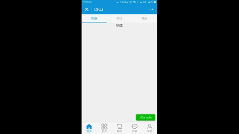

- 效果展现



- 代码
## .wxml
```html
<view class="swiper-tab">  
    <view class="swiper-tab-list {{currentTab==0 ? 'on' : ''}}" data-current="0" bindtap="swichNav">最新</view>  
    <view class="swiper-tab-list {{currentTab==1 ? 'on' : ''}}" data-current="1" bindtap="swichNav">价格</view>  
    <view class="swiper-tab-list {{currentTab==2 ? 'on' : ''}}" data-current="2" bindtap="swichNav">热度</view>
</view>  
  
<swiper current="{{currentTab}}" class="swiper-box" duration="300" style="height:{{winHeight - 31}}px" bindchange="bindChange">  
    <swiper-item>  
      <view>最新</view>  
    </swiper-item>  
    <swiper-item>  
      <view>价格</view>  
    </swiper-item>  
    <swiper-item>  
      <view>热度</view>  
    </swiper-item>  
</swiper>  
```
## .wxss
```css
.swiper-tab{  
    width: 100%;   
    text-align: center;  
    line-height: 80rpx;
    background-color:#fcfbfb;
    }  
.swiper-tab-list{  font-size: 30rpx;  
    display: inline-block;  
    width: 33.33%;  
    color: #989898;  
}  
.on{ color: #1296db;  
    border-bottom: 5rpx solid #1296db;}  
  
.swiper-box{ display: block; height: 100%; width: 100%; overflow: hidden; }  
.swiper-box view{  
    text-align: center;  
}  
```
## .js
```js
//index.js  
//获取应用实例  
var app = getApp()
Page({
  data: {
    /** 
        * 页面配置 
        */
    winWidth: 0,
    winHeight: 0,
    // tab切换  
    currentTab: 0,
  },
  onLoad: function () {
    var that = this;

    /** 
     * 获取系统信息 
     */
    wx.getSystemInfo({

      success: function (res) {
        that.setData({
          winWidth: res.windowWidth,
          winHeight: res.windowHeight
        });
      }

    });
  },
  /** 
     * 滑动切换tab 
     */
  bindChange: function (e) {

    var that = this;
    that.setData({ currentTab: e.detail.current });

  },
  /** 
   * 点击tab切换 
   */
  swichNav: function (e) {

    var that = this;

    if (this.data.currentTab === e.target.dataset.current) {
      return false;
    } else {
      that.setData({
        currentTab: e.target.dataset.current
      })
    }
  }
})  

```