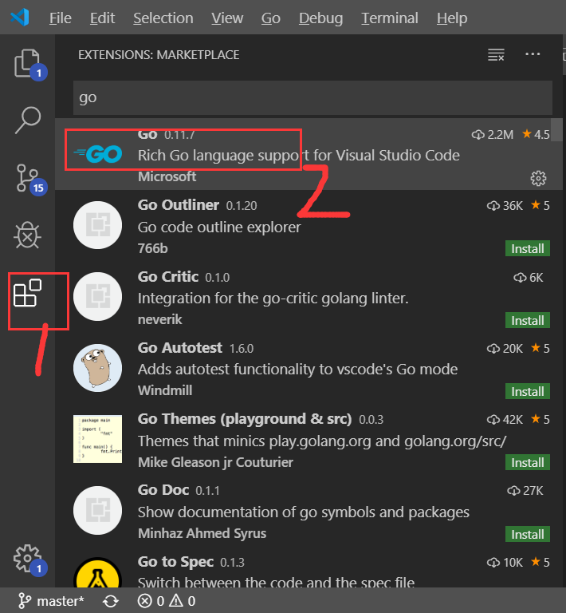

总操作流程：
- 1、[下载安装](#go-01)
- 3、[配置](#go-02)
- 2、[测试](#go-03)

***

## 下载安装 <a name="go-01" href="#" >:house:</a>

- vs code下载go组件



## 配置 <a name="go-02" href="#" >:house:</a>

> vs code 进入 设置>扩展>json>在setting.json中编辑

- go的组件配置

```json
    "go.buildOnSave": "workspace",
    "go.lintOnSave": "package",
    "go.vetOnSave": "package",
    "go.buildTags": "",
    "go.buildFlags": [],
    "go.lintFlags": [],
    "go.vetFlags": [],
    "go.coverOnSave": false,
    "go.useLanguageServer": true,
    "go.useCodeSnippetsOnFunctionSuggest": true,
    "go.useCodeSnippetsOnFunctionSuggestWithoutType": true,
    "go.gocodePackageLookupMode": "go",
    "go.gotoSymbol.includeImports": true,
    "go.docsTool": "gogetdoc",
    "go.formatTool": "goreturns",
    "go.goroot": "C:\\SoftWare\\Go",
    "go.gopath": "D:\\goWork",
    "go.gocodeAutoBuild": false,
    "go.inferGopath": true,
```

- 终端的配置

```json
"terminal.integrated.shell.windows": "C:\\Windows\\System32\\cmd.exe",
```

## 测试 <a name="go-03" href="#" >:house:</a>

> 1、在gowork文件夹下创建test.go文件

```go
package main
import "fmt"
func main() {
   /* 这是我的第一个简单的程序 */
   fmt.Println("Hello, World!")
}
```

> 2、快捷键：ctrl+` 进入vs code的终端输入命令看效果

```shell
go run test.go
```

