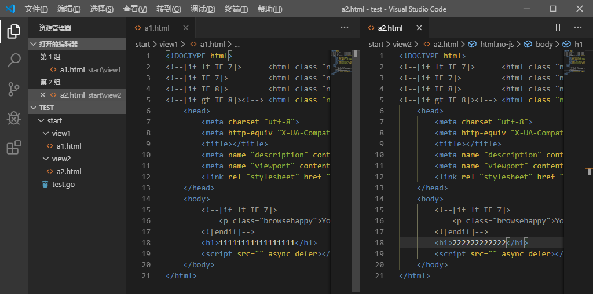

总操作流程：
- 1、[写代码](#go-01)
- 2、[编译](#go-02)
- 3、[看效果](#go-03)

***

## 写代码 <a name="go-01" href="#" >:house:</a>

- 项目目录



> 写代码

- test.go

```go
package main

import (
	"github.com/gin-gonic/gin"
	"net/http"
)

func main() {
	r := gin.Default() 
	r.Static("/html","./view1")
	r.StaticFS("/html2",http.Dir("./view2"))
	r.Run() // 启动并监听8080端口
}

```

## 编译 <a name="go-02" href="#" >:house:</a>

> 按快捷键：<kbd>Ctrl</kbd>+<kbd>`</kbd>,vs code进入终端输入命令。

```shell
set GO111MODULE=on
set GOPROXY=https://goproxy.io

go mod init test
go mod tidy

```


> 运行

```shell

cd start

go run test.go
```

## 看效果 <a name="go-03" href="#" >:house:</a>

> 浏览器分别输入地址看效果：
- http://localhost:8080/html1/a1.html
- http://localhost:8080/html2/a2.html

