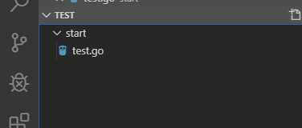
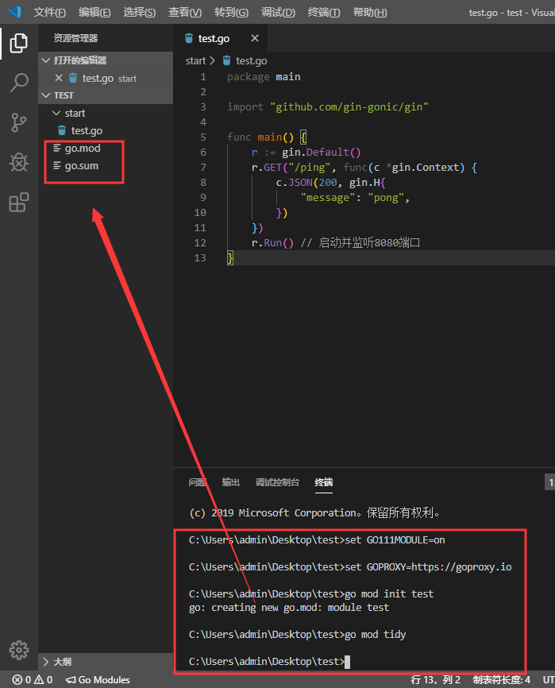
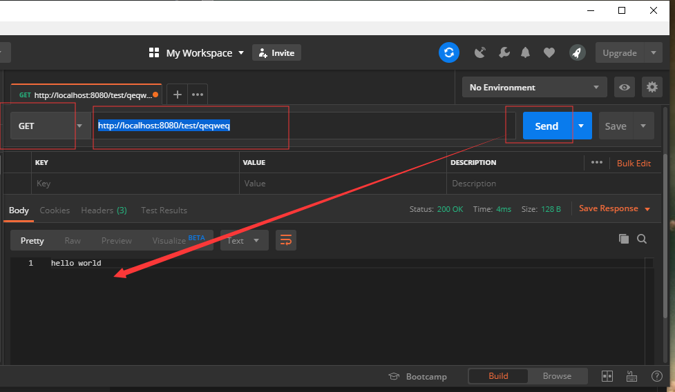

总操作流程：
- 1、[写代码](#go-01)
- 2、[编译](#go-02)
- 3、[看效果](#go-03)

***

## 写代码 <a name="go-01" href="#" >:house:</a>

- 项目目录



> 写代码

- test.go

```go
package main

import "github.com/gin-gonic/gin"

func main() {
	r := gin.Default() 
	r.GET("/test/*action", func(c *gin.Context) {
		c.String(200,"hello world")
	})
	r.Run() // 启动并监听8080端口
}
```

## 编译 <a name="go-02" href="#" >:house:</a>

> 按快捷键：<kbd>Ctrl</kbd>+<kbd>`</kbd>,vs code进入终端输入命令。

```shell
set GO111MODULE=on
set GOPROXY=https://goproxy.io

go mod init test
go mod tidy

```



> 运行

```shell
go run start/test.go
```

## 看效果 <a name="go-03" href="#" >:house:</a>

> 使用postman进行接口测试

```shell
http://localhost:8080/test/qeqweq
```

