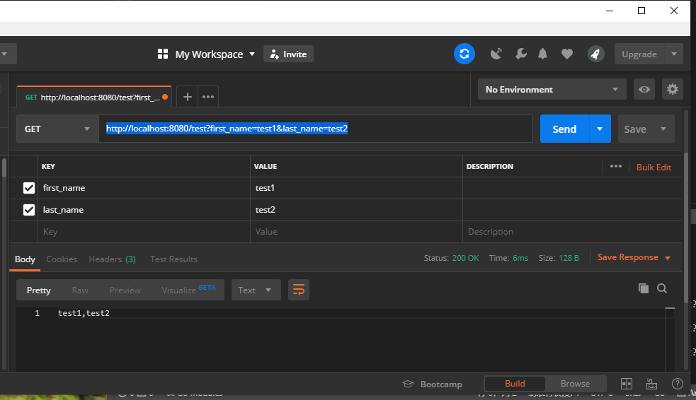

总操作流程：
- 1、[写代码](#go-01)
- 2、[编译](#go-02)
- 3、[看效果](#go-03)

***

## 写代码 <a name="go-01" href="#" >:house:</a>

- 项目目录


> 写代码

- test.go

```go
package main

import (
	"github.com/gin-gonic/gin"
	"net/http"
)

func main() {
	r := gin.Default() 
	r.GET("/test", func(c *gin.Context) {
		firstName:=c.Query("first_name")
		lastName:=c.DefaultQuery("last_name","last_default_name")
		c.String(http.StatusOK,"%s,%s",firstName,lastName)
	})
	r.Run() // 启动并监听8080端口
}
```

## 编译 <a name="go-02" href="#" >:house:</a>

> 按快捷键：<kbd>Ctrl</kbd>+<kbd>`</kbd>,vs code进入终端输入命令。

```shell
set GO111MODULE=on
set GOPROXY=https://goproxy.io

go mod init test
go mod tidy

```


> 运行

```shell
go run start/test.go
```

## 看效果 <a name="go-03" href="#" >:house:</a>

> 使用postman进行接口测试

```shell
http://localhost:8080/test?first_name=test1&last_name=test2
```

