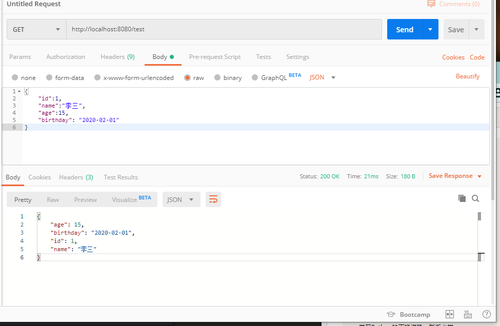

总操作流程：
- 1、[写代码](#go-01)
- 2、[编译](#go-02)
- 3、[看效果](#go-03)

***

## 写代码 <a name="go-01" href="#" >:house:</a>

```go
package main

import (
	"net/http"
	"github.com/gin-gonic/gin"
)

type Test struct {
	ID int
	Name string 
	Age int
	Birthday string
}

func main() {
	r := gin.Default() 
	r.GET("/test", testing)
	r.Run() // 启动并监听8080端口
}

func testing(c *gin.Context){
	var test Test
	err :=c.BindJSON(&test)
	if err==nil{
		c.JSON(200, gin.H{
			"id": test.ID,
			"name": test.Name,
			"age": test.Age,
			"birthday": test.Birthday,
		})
	}else{
		c.String(http.StatusOK,"%v","test bind error:%v",err)
	}
}
```

## 编译 <a name="go-02" href="#" >:house:</a>

> 按快捷键：<kbd>Ctrl</kbd>+<kbd>`</kbd>,vs code进入终端输入命令。

```shell
set GO111MODULE=on
set GOPROXY=https://goproxy.io

go mod init test
go mod tidy
```

## 看效果 <a name="go-03" href="#" >:house:</a>

> 使用postman进行接口测试: http://localhost:8080/test

