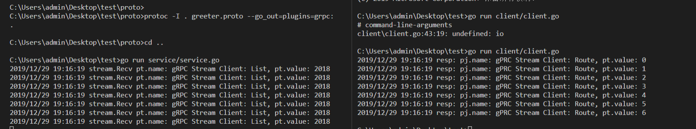

总操作流程：
- 1、[写代码](#go-01)
- 2、[测试](#go-02)

***

> 解释：结合客户端流式rpc和服务端流式rpc，可以传入多个对象，返回多个响应对象

## 写代码 <a name="go-01" href="#" >:house:</a>

> 项目目录


> greeter.proto

<details>
<summary>代码</summary>

```js
syntax = "proto3";

package proto;

service StreamService {
    rpc Route(stream StreamRequest) returns (stream StreamResponse) {};
}


message StreamPoint {
  string name = 1;
  int32 value = 2;
}

message StreamRequest {
  StreamPoint pt = 1;
}

message StreamResponse {
  StreamPoint pt = 1;
}
```

</details>

- 编译greeter.proto

```js
# 进入proto目录下，在shell输入命令

cd proto

protoc -I . greeter.proto --go_out=plugins=grpc:.
```

> service.go

<details>
<summary>代码</summary>

```go
package main

import (
	"log"
	"net"
	"io"
	"google.golang.org/grpc"
	proto "test/proto"
 
)
 
type StreamService struct{}

const (
    PORT = "9002"
)

func main() {
    lis, err := net.Listen("tcp", ":"+PORT)
    if err != nil {
        log.Fatalf("net.Listen err: %v", err)
	}
	
	server := grpc.NewServer()
	proto.RegisterStreamServiceServer(server, &StreamService{})
	
    server.Serve(lis)
}

func (s *StreamService) Route(stream proto.StreamService_RouteServer) error {
    n := 0
    for {
        err := stream.Send(&proto.StreamResponse{
            Pt: &proto.StreamPoint{
                Name:  "gPRC Stream Client: Route",
                Value: int32(n),
            },
        })
        if err != nil {
            return err
        }

        r, err := stream.Recv()
        if err == io.EOF {
            return nil
        }
        if err != nil {
            return err
        }

        n++

        log.Printf("stream.Recv pt.name: %s, pt.value: %d", r.Pt.Name, r.Pt.Value)
    }

    return nil
}
```

</details>

> client.go

<details>
<summary>代码</summary>

```go
package main
 
import (
	"log"
	"context"
	"io"
	"google.golang.org/grpc"
	proto "test/proto"
)
 
const (
    PORT = "9002"
)

func main() {
    conn, err := grpc.Dial(":"+PORT, grpc.WithInsecure())
    if err != nil {
        log.Fatalf("grpc.Dial err: %v", err)
    }

    defer conn.Close()

    client := proto.NewStreamServiceClient(conn)

    err = printRoute(client, &proto.StreamRequest{Pt: &proto.StreamPoint{Name: "gRPC Stream Client: List", Value: 2018}})
    if err != nil {
        log.Fatalf("printLists.err: %v", err)
    }
}

func printRoute(client proto.StreamServiceClient, r *proto.StreamRequest) error {
    stream, err := client.Route(context.Background())
    if err != nil {
        return err
    }

    for n := 0; n <= 6; n++ {
        err = stream.Send(r)
        if err != nil {
            return err
        }

        resp, err := stream.Recv()
        if err == io.EOF {
            break
        }
        if err != nil {
            return err
        }

        log.Printf("resp: pj.name: %s, pt.value: %d", resp.Pt.Name, resp.Pt.Value)
    }

    stream.CloseSend()

    return nil
}
```

</details>

## 测试 <a name="go-02" href="#" >:house:</a>

> 下载依赖

- 开启mod

`在test目录下进行命令输入`

```shell
cd ..
set GO111MODULE=on
set GOPROXY=https://goproxy.io

go mod init test
go mod tidy
```

- 复原的命令

```
set GO111MODULE=auto
set  GOPROXY=
```

> 启动服务端

```js
go run service/service.go
```

> 启动客户端

```js
go run client/client.go
```


