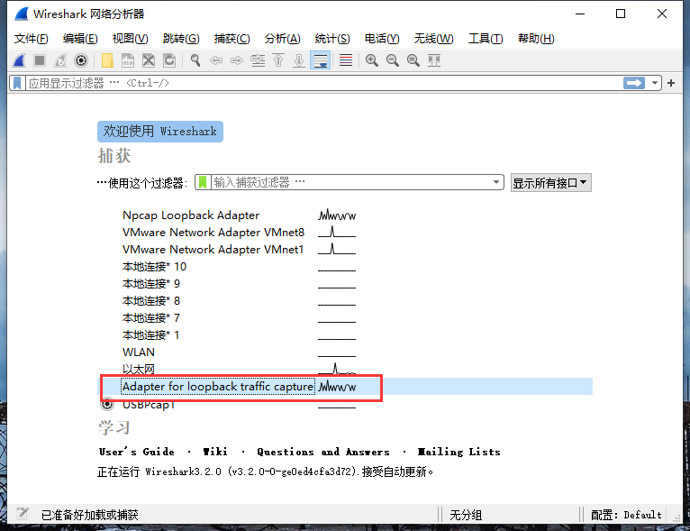
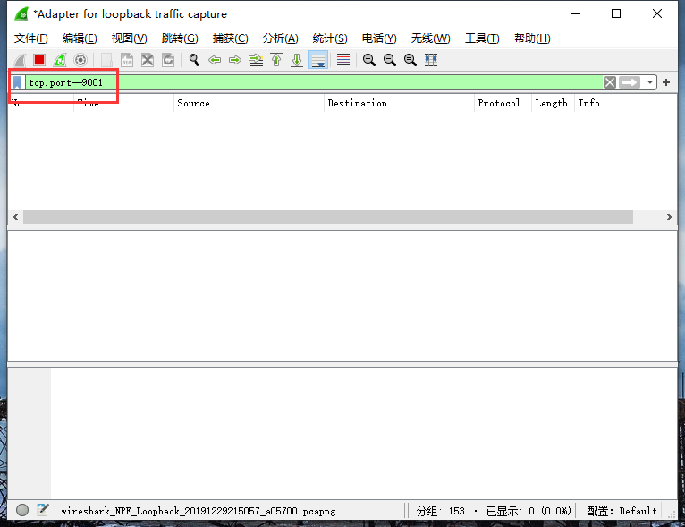
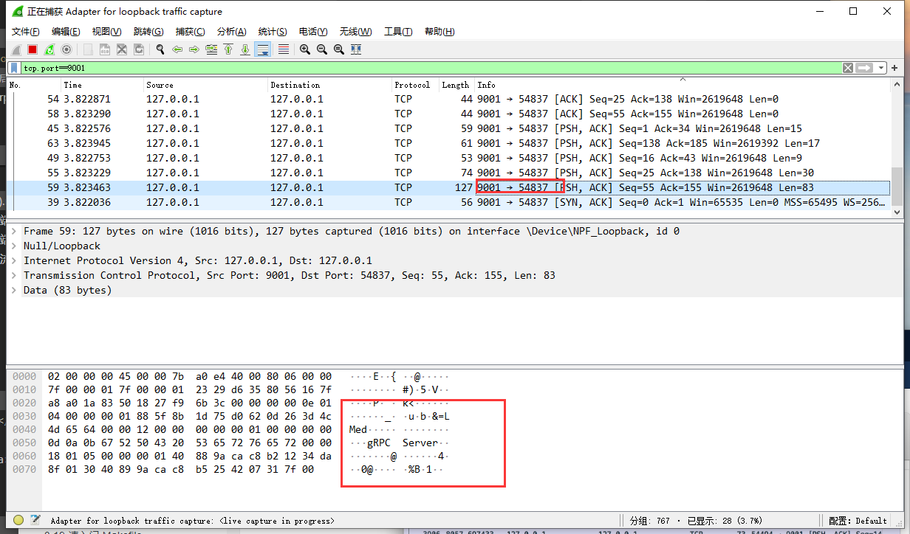
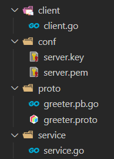
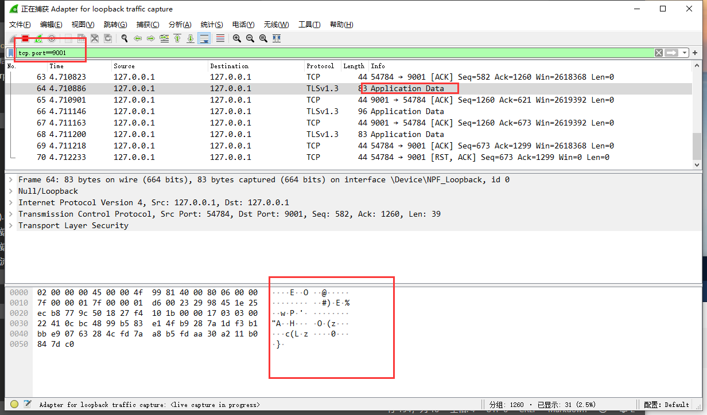

总操作流程：
- 1、下载安装
- 2、写代码
- 3、测试

***

## 下载安装

> 下载安装wireshark抓包工具

[](https://www.wireshark.org/#download)

> 测试

- 1、开启wireshark的抓包模式



```
tcp.port==9001
```



- 2、运行代码的service.go和client.go

[](/后台/Golang/03.01.go-grpc之Simple RPC（简单rpc）.md)

- 3、抓到包的效果




> 下载安装

[](http://slproweb.com/products/Win32OpenSSL.html)

- 解压配置变量环境

```
变量名：OPENSSL_HOME
变量值：C:\Software\OpenSSL-Win64
path：;%OPENSSL_HOME%\bin
```

- 测试

```
openssl version
```

## 写代码

- 项目目录



> 证书生成

```shell
#运行cmd，进入conf的目录下

# 私钥，自动生成server.key
openssl ecparam -genkey -name secp384r1 -out server.key

# 自签公钥，自动生成server.pem
openssl req -new -x509 -sha256 -key server.key -out server.pem -days 3650

# 填写信息时，需要这个Common Name写到客户端那里
Common Name (eg, fully qualified host name) []:DK_Li
```


> greeter.proto

<details>
<summary>代码</summary>

```js

syntax = "proto3";

package proto;

service SearchService {
    rpc Search(SearchRequest) returns (SearchResponse) {}
}

message SearchRequest {
    string request = 1;
}

message SearchResponse {
    string response = 1;
}
```

</details>

- 编译greeter.proto

```js
# 进入proto目录下，在shell输入命令

cd proto

protoc -I . greeter.proto --go_out=plugins=grpc:.
```

> Server

<details>
<summary>代码</summary>

```go
package main

import (
	"context"
    "log"
    "net"

    "google.golang.org/grpc"
    "google.golang.org/grpc/credentials"

    proto "test/proto"
)

type SearchService struct{}

func (s *SearchService) Search(ctx context.Context, r *proto.SearchRequest) (*proto.SearchResponse, error) {
	return &proto.SearchResponse{Response: r.GetRequest() + " Server"}, nil
}

const PORT = "9001"

func main() {
    c, err := credentials.NewServerTLSFromFile("../test/conf/server.pem", "../test/conf/server.key")
    if err != nil {
        log.Fatalf("credentials.NewServerTLSFromFile err: %v", err)
	}
	
	lis, err := net.Listen("tcp", ":"+PORT)
    if err != nil {
        log.Fatalf("net.Listen err: %v", err)
	}
	
    server := grpc.NewServer(grpc.Creds(c))
    proto.RegisterSearchServiceServer(server, &SearchService{})

    server.Serve(lis)
}

```

</details>

> client

<details>
<summary>代码</summary>

```go
package main
 
import (
    "context"
    "log"

    "google.golang.org/grpc"
    "google.golang.org/grpc/credentials"
	proto "test/proto"
)
 
const PORT = "9001"

func main() {
    c, err := credentials.NewClientTLSFromFile("../test/conf/server.pem", "DK_Li")
    if err != nil {
        log.Fatalf("credentials.NewClientTLSFromFile err: %v", err)
    }

    conn, err := grpc.Dial(":"+PORT, grpc.WithTransportCredentials(c))
    if err != nil {
        log.Fatalf("grpc.Dial err: %v", err)
    }
    defer conn.Close()

    client := proto.NewSearchServiceClient(conn)
    resp, err := client.Search(context.Background(), &proto.SearchRequest{
        Request: "gRPC",
    })
    if err != nil {
        log.Fatalf("client.Search err: %v", err)
    }

    log.Printf("resp: %s", resp.GetResponse())
}
```

</details>

## 测试


> 运行代码的service.go和client.go

> 使用wireshark测试查看

