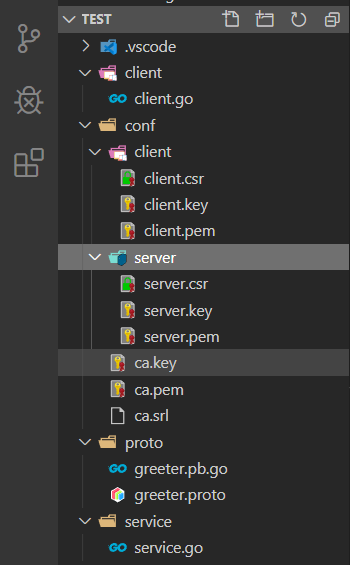

总操作流程：
- 1、[写代码](#go-01)
- 2、[测试](#go-02)

***

## 写代码 <a name="go-01" href="#" >:house:</a>

> 项目目录



> CA的TLS 证书认证

- 1、ca

```shell
# 运行cmd，进入conf的文件夹下
openssl genrsa -out ca.key 2048

openssl req -new -x509 -days 7200 -key ca.key -out ca.pem

# 填写信息时，需要这个Common Name写到客户端那里
Common Name (eg, fully qualified host name) []:DK_Li

```

- 2、server
```shell
# 运行cmd，进入conf/server的文件夹下
cd server

# 私钥，自动生成server.key
openssl ecparam -genkey -name secp384r1 -out server.key

# 生成 CSR
openssl req -new -key server.key -out server.csr

# 填写信息时，需要这个Common Name写到客户端那里
Common Name (eg, fully qualified host name) []:DK_Li

# 基于 CA 签发
openssl x509 -req -sha256 -CA ../ca.pem -CAkey ../ca.key -CAcreateserial -days 3650 -in server.csr -out server.pem


```

- 3、client
```shell
# 运行cmd，进入conf/client的文件夹下
cd client
# 私钥，自动生成client.key
openssl ecparam -genkey -name secp384r1 -out client.key

# 生成 CSR
openssl req -new -key client.key -out client.csr

# 填写信息时，需要这个Common Name写到客户端那里
Common Name (eg, fully qualified host name) []:DK_Li

# 基于 CA 签发
openssl x509 -req -sha256 -CA ../ca.pem -CAkey ../ca.key -CAcreateserial -days 3650 -in client.csr -out client.pem


```
> greeter.proto

<details>
<summary>代码</summary>

```js

syntax = "proto3";

package proto;

service SearchService {
    rpc Search(SearchRequest) returns (SearchResponse) {}
}

message SearchRequest {
    string request = 1;
}

message SearchResponse {
    string response = 1;
}
```

</details>

- 编译greeter.proto

```js
# 进入proto目录下，在shell输入命令

cd proto

protoc -I . greeter.proto --go_out=plugins=grpc:.
```

> Server

<details>
<summary>代码</summary>

```go
package main
 
import (
    "context"
    "log"
    "net"
    "crypto/tls"
    "crypto/x509"
    "io/ioutil"

    "google.golang.org/grpc"
    "google.golang.org/grpc/credentials"
	proto "test/proto"
 
)

type SearchService struct{}

func (s *SearchService) Search(ctx context.Context, r *proto.SearchRequest) (*proto.SearchResponse, error) {
	return &proto.SearchResponse{Response: r.GetRequest() + " Server"}, nil
}

const PORT = "9001"

func main() {
    cert, err := tls.LoadX509KeyPair("../test/conf/server/server.pem", "../test/conf/server/server.key")
    if err != nil {
        log.Fatalf("tls.LoadX509KeyPair err: %v", err)
    }

    certPool := x509.NewCertPool()
    ca, err := ioutil.ReadFile("../test/conf/ca.pem")
    if err != nil {
        log.Fatalf("ioutil.ReadFile err: %v", err)
    }

    if ok := certPool.AppendCertsFromPEM(ca); !ok {
        log.Fatalf("certPool.AppendCertsFromPEM err")
    }

    c := credentials.NewTLS(&tls.Config{
        Certificates: []tls.Certificate{cert},
        ClientAuth:   tls.RequireAndVerifyClientCert,
        ClientCAs:    certPool,
    })

    server := grpc.NewServer(grpc.Creds(c))
    proto.RegisterSearchServiceServer(server, &SearchService{})

    lis, err := net.Listen("tcp", ":"+PORT)
    if err != nil {
        log.Fatalf("net.Listen err: %v", err)
    }

    server.Serve(lis)
}
```

</details>

> client

<details>
<summary>代码</summary>

```go
package main
 
import (
	"context"
    "crypto/tls"
    "crypto/x509"
    "io/ioutil"
    "log"

    "google.golang.org/grpc"
    "google.golang.org/grpc/credentials"
	proto "test/proto"
)

const PORT = "9001"

func main() {
    cert, err := tls.LoadX509KeyPair("../test/conf/client/client.pem", "../test/conf/client/client.key")
    if err != nil {
        log.Fatalf("tls.LoadX509KeyPair err: %v", err)
    }

    certPool := x509.NewCertPool()
    ca, err := ioutil.ReadFile("../test/conf/ca.pem")
    if err != nil {
        log.Fatalf("ioutil.ReadFile err: %v", err)
    }

    if ok := certPool.AppendCertsFromPEM(ca); !ok {
        log.Fatalf("certPool.AppendCertsFromPEM err")
    }

    c := credentials.NewTLS(&tls.Config{
        Certificates: []tls.Certificate{cert},
        ServerName:   "DK_Li",
        RootCAs:      certPool,
    })

    conn, err := grpc.Dial(":"+PORT, grpc.WithTransportCredentials(c))
    if err != nil {
        log.Fatalf("grpc.Dial err: %v", err)
    }
    defer conn.Close()

    client := proto.NewSearchServiceClient(conn)
    resp, err := client.Search(context.Background(), &proto.SearchRequest{
        Request: "gRPC",
    })
    if err != nil {
        log.Fatalf("client.Search err: %v", err)
    }

    log.Printf("resp: %s", resp.GetResponse())
}
```

</details>


## 测试 <a name="go-02" href="#" >:house:</a>

> 运行代码的service.go和client.go

> 使用wireshark测试查看