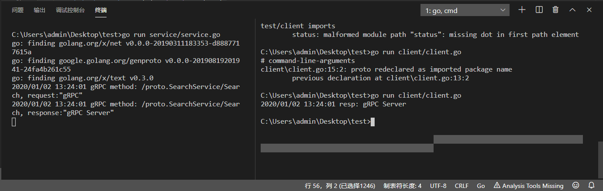

总操作流程：
- 1、[写代码](#go-01)
- 2、[测试](#go-02)

***

> 该教程基于：go-grpc之TLS 证书认证

## 写代码 <a name="go-01" href="#" >:house:</a>

- 项目目录


> 创建工具文件pkg/gtls文件

- 1、server.go

<details>
<summary>代码</summary>

```go
package gtls

import (
	"crypto/tls"
	"crypto/x509"
	"errors"
	"io/ioutil"

	"google.golang.org/grpc/credentials"
)

type Server struct {
	CaFile   string
	CertFile string
	KeyFile  string
}

func (t *Server) GetCredentialsByCA() (credentials.TransportCredentials, error) {
	cert, err := tls.LoadX509KeyPair(t.CertFile, t.KeyFile)
	if err != nil {
		return nil, err
	}

	certPool := x509.NewCertPool()
	ca, err := ioutil.ReadFile(t.CaFile)
	if err != nil {
		return nil, err
	}

	if ok := certPool.AppendCertsFromPEM(ca); !ok {
		return nil, errors.New("certPool.AppendCertsFromPEM err")
	}

	c := credentials.NewTLS(&tls.Config{
		Certificates: []tls.Certificate{cert},
		ClientAuth:   tls.RequireAndVerifyClientCert,
		ClientCAs:    certPool,
	})

	return c, err
}

func (t *Server) GetTLSCredentials() (credentials.TransportCredentials, error) {
	c, err := credentials.NewServerTLSFromFile(t.CertFile, t.KeyFile)
	if err != nil {
		return nil, err
	}

	return c, err
}
```

</details>

- 2、client.go

<details>
<summary>代码</summary>

```go
package gtls

import (
	"crypto/tls"
	"crypto/x509"
	"io/ioutil"

	"google.golang.org/grpc/credentials"
)

type Client struct {
	ServerName string
	CaFile     string
	CertFile   string
	KeyFile    string
}

func (t *Client) GetCredentialsByCA() (credentials.TransportCredentials, error) {
	cert, err := tls.LoadX509KeyPair(t.CertFile, t.KeyFile)
	if err != nil {
		return nil, err
	}

	certPool := x509.NewCertPool()
	ca, err := ioutil.ReadFile(t.CaFile)
	if err != nil {
		return nil, err
	}

	if ok := certPool.AppendCertsFromPEM(ca); !ok {
		return nil, err
	}

	c := credentials.NewTLS(&tls.Config{
		Certificates: []tls.Certificate{cert},
		ServerName:   t.ServerName,
		RootCAs:      certPool,
	})

	return c, err
}

func (t *Client) GetTLSCredentials() (credentials.TransportCredentials, error) {
	c, err := credentials.NewClientTLSFromFile(t.CertFile, t.ServerName)
	if err != nil {
		return nil, err
	}

	return c, err
}
```

</details>

> service.go

<details>
<summary>代码</summary>

```go
package main
 
import (
	"context"
	"github.com/grpc-ecosystem/go-grpc-middleware"
	"google.golang.org/grpc"
	"google.golang.org/grpc/codes"
	"google.golang.org/grpc/status"
	"log"
	"net"
	"runtime/debug"
	
    "test/pkg/gtls"
	proto "test/proto"
 
)

type SearchService struct{}

func (s *SearchService) Search(ctx context.Context, r *proto.SearchRequest) (*proto.SearchResponse, error) {
	if ctx.Err() == context.Canceled {
		return nil, status.Errorf(codes.Canceled, "searchService.Search canceled")
	}

	return &proto.SearchResponse{Response: r.GetRequest() + " Server"}, nil
}

const PORT = "9001"

func main() {
	tlsServer := gtls.Server{
		CaFile:   "../test/conf/ca.pem",
		CertFile: "../test/conf/server/server.pem",
		KeyFile:  "../test/conf/server/server.key",
	}
	c, err := tlsServer.GetCredentialsByCA()
	if err != nil {
		log.Fatalf("GetTLSCredentialsByCA err: %v", err)
	}

	opts := []grpc.ServerOption{
		grpc.Creds(c),
		grpc_middleware.WithUnaryServerChain(
			RecoveryInterceptor,
			LoggingInterceptor,
		),
	}

	server := grpc.NewServer(opts...)
	proto.RegisterSearchServiceServer(server, &SearchService{})

	lis, err := net.Listen("tcp", ":"+PORT)
	if err != nil {
		log.Fatalf("net.Listen err: %v", err)
	}

	server.Serve(lis)
}

func LoggingInterceptor(ctx context.Context, req interface{}, info *grpc.UnaryServerInfo, handler grpc.UnaryHandler) (interface{}, error) {
	log.Printf("gRPC method: %s, %v", info.FullMethod, req)
	resp, err := handler(ctx, req)
	log.Printf("gRPC method: %s, %v", info.FullMethod, resp)
	return resp, err
}

func RecoveryInterceptor(ctx context.Context, req interface{}, info *grpc.UnaryServerInfo, handler grpc.UnaryHandler) (resp interface{}, err error) {
	defer func() {
		if e := recover(); e != nil {
			debug.PrintStack()
			err = status.Errorf(codes.Internal, "Panic err: %v", e)
		}
	}()

	return handler(ctx, req)
}
```

</details>

> client.go

<details>
<summary>代码</summary>

```go
package main
 
import (
    "context"
	"log"
	"time"

	"google.golang.org/grpc"
	"google.golang.org/grpc/codes"
	"google.golang.org/grpc/status"
    
    "test/pkg/gtls"
	proto "test/proto"
)

const PORT = "9001"

func main() {
	tlsClient := gtls.Client{
		ServerName: "DK_Li",
		CaFile:     "../test/conf/ca.pem",
		CertFile:   "../test/conf/client/client.pem",
		KeyFile:    "../test/conf/client/client.key",
	}

	c, err := tlsClient.GetCredentialsByCA()
	if err != nil {
		log.Fatalf("GetTLSCredentialsByCA err: %v", err)
	}

	conn, err := grpc.Dial(":"+PORT, grpc.WithTransportCredentials(c))
	if err != nil {
		log.Fatalf("grpc.Dial err: %v", err)
	}
	defer conn.Close()

	ctx, cancel := context.WithDeadline(context.Background(), time.Now().Add(time.Duration(5*time.Second)))
	defer cancel()

	client := proto.NewSearchServiceClient(conn)
	resp, err := client.Search(ctx, &proto.SearchRequest{
		Request: "gRPC",
	})
	if err != nil {
		statusErr, ok := status.FromError(err)
		if ok {
			if statusErr.Code() == codes.DeadlineExceeded {
				log.Fatalln("client.Search err: deadline")
			}
		}

		log.Fatalf("client.Search err: %v", err)
	}

	log.Printf("resp: %s", resp.GetResponse())
}
```

</details>

## 测试 <a name="go-02" href="#" >:house:</a>

> 启动服务端

```js
go run service/service.go
```

> 启动客户端

```js
go run client/client.go
```

