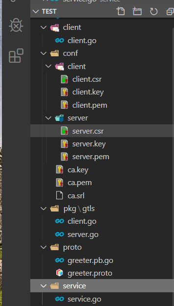
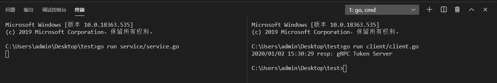

总操作流程：
- 1、[写代码](#go-01)
- 2、[测试](#go-02)

***

> 该教程基于：go-grpc之TLS 证书认证

## 写代码 <a name="go-01" href="#" >:house:</a>

- 项目目录


> service.go

<details>
<summary>代码</summary>

```go
package main
 
import (
	"context"
	"log"
	"net"

	"google.golang.org/grpc"
	"google.golang.org/grpc/codes"
	"google.golang.org/grpc/metadata"
	"google.golang.org/grpc/status"
	
    "test/pkg/gtls"
	proto "test/proto"
 
)
type SearchService struct {
	auth *Auth
}

func (s *SearchService) Search(ctx context.Context, r *proto.SearchRequest) (*proto.SearchResponse, error) {
	if err := s.auth.Check(ctx); err != nil {
		return nil, err
	}
	return &proto.SearchResponse{Response: r.GetRequest() + " Token Server"}, nil
}

const PORT = "9004"

func main() {
	certFile := "../test/conf/server/server.pem"
	keyFile := "../test/conf/server/server.key"
	tlsServer := gtls.Server{
		CertFile: certFile,
		KeyFile:  keyFile,
	}

	c, err := tlsServer.GetTLSCredentials()
	if err != nil {
		log.Fatalf("tlsServer.GetTLSCredentials err: %v", err)
	}

	server := grpc.NewServer(grpc.Creds(c))
	proto.RegisterSearchServiceServer(server, &SearchService{})

	lis, err := net.Listen("tcp", ":"+PORT)
	if err != nil {
		log.Fatalf("net.Listen err: %v", err)
	}

	server.Serve(lis)
}

type Auth struct {
	appKey    string
	appSecret string
}

func (a *Auth) Check(ctx context.Context) error {
	md, ok := metadata.FromIncomingContext(ctx)
	if !ok {
		return status.Errorf(codes.Unauthenticated, "metadata.FromIncomingContext err")
	}

	var (
		appKey    string
		appSecret string
	)
	if value, ok := md["app_key"]; ok {
		appKey = value[0]
	}
	if value, ok := md["app_secret"]; ok {
		appSecret = value[0]
	}

	if appKey != a.GetAppKey() || appSecret != a.GetAppSecret() {
		return status.Errorf(codes.Unauthenticated, "invalid token")
	}

	return nil
}

func (a *Auth) GetAppKey() string {
	return "eddycjy"
}

func (a *Auth) GetAppSecret() string {
	return "20181005"
}
```

</details>

> client.go

<details>
<summary>代码</summary>

```go
package main

import (
	"context"
	"log"

	"google.golang.org/grpc"

	"test/pkg/gtls"
	proto "test/proto"
)

const PORT = "9004"

type Auth struct {
	AppKey    string
	AppSecret string
}

func (a *Auth) GetRequestMetadata(ctx context.Context, uri ...string) (map[string]string, error) {
	return map[string]string{"app_key": a.AppKey, "app_secret": a.AppSecret}, nil
}

func (a *Auth) RequireTransportSecurity() bool {
	return true
}

func main() {
	tlsClient := gtls.Client{
		ServerName: "DK_Li",
		CertFile:   "../test/conf/server/server.pem",
	}
	c, err := tlsClient.GetTLSCredentials()
	if err != nil {
		log.Fatalf("tlsClient.GetTLSCredentials err: %v", err)
	}

	auth := Auth{
		AppKey:    "eddycjy",
		AppSecret: "20181005",
	}
	conn, err := grpc.Dial(":"+PORT, grpc.WithTransportCredentials(c), grpc.WithPerRPCCredentials(&auth))
	if err != nil {
		log.Fatalf("grpc.Dial err: %v", err)
	}
	defer conn.Close()

	client := proto.NewSearchServiceClient(conn)
	resp, err := client.Search(context.Background(), &proto.SearchRequest{
		Request: "gRPC",
	})
	if err != nil {
		log.Fatalf("client.Search err: %v", err)
	}

	log.Printf("resp: %s", resp.GetResponse())
}
```

</details>

## 测试 <a name="go-02" href="#" >:house:</a>

> 启动服务端

```js
go run service/service.go
```

> 启动客户端

```js
go run client/client.go
```
