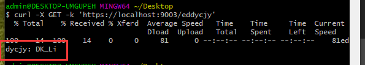

总操作流程：
- 1、[写代码](#go-01)
- 2、[测试](#go-02)

***

> 该教程基于：Unary and Stream interceptor(拦截器)

## 写代码 <a name="go-01" href="#" >:house:</a>

- 项目目录


> service.go

<details>
<summary>代码</summary>

```go
package main
 
import (
	"google.golang.org/grpc"
    "context"
    "log"
    "net/http"
    "strings"
	
    "test/pkg/gtls"
	proto "test/proto"
 
)

type SearchService struct{}

func (s *SearchService) Search(ctx context.Context, r *proto.SearchRequest) (*proto.SearchResponse, error) {
    return &proto.SearchResponse{Response: r.GetRequest() + " HTTP Server"}, nil
}

const PORT = "9003"

func main() {
    certFile := "../test/conf/server/server.pem"
    keyFile := "../test/conf/server/server.key"
    tlsServer := gtls.Server{
        CertFile: certFile,
        KeyFile:  keyFile,
    }

    c, err := tlsServer.GetTLSCredentials()
    if err != nil {
        log.Fatalf("tlsServer.GetTLSCredentials err: %v", err)
    }

    mux := GetHTTPServeMux()

    server := grpc.NewServer(grpc.Creds(c))
    proto.RegisterSearchServiceServer(server, &SearchService{})

    http.ListenAndServeTLS(":"+PORT,
        certFile,
        keyFile,
        http.HandlerFunc(func(w http.ResponseWriter, r *http.Request) {
            if r.ProtoMajor == 2 && strings.Contains(r.Header.Get("Content-Type"), "application/grpc") {
                server.ServeHTTP(w, r)
            } else {
                mux.ServeHTTP(w, r)
            }

            return
        }),
    )
}

func GetHTTPServeMux() *http.ServeMux {
    mux := http.NewServeMux()
    mux.HandleFunc("/", func(w http.ResponseWriter, r *http.Request) {
        w.Write([]byte("eddycjy: DK_Li"))
    })

    return mux
}
```

</details>


## 测试 <a name="go-02" href="#" >:house:</a>

> 启动服务端

```js
go run service/service.go
```

> 运行git bash here，输入命令

```js
curl -X GET -k 'https://localhost:9003/eddycjy'
```

