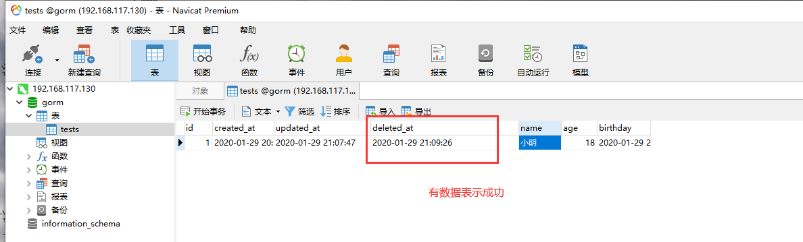

总操作流程：
- 1、[写代码](#go-01)
- 2、[看效果](#go-02)

***

## 写代码 <a name="go-01" href="#" >:house:</a>

<details>
<summary>代码</summary>

```go
package main

import (
    "time"
    "github.com/jinzhu/gorm"
    _ "github.com/jinzhu/gorm/dialects/mysql"
    "log"
    "fmt"
)

type Test struct {
  gorm.Model
  Name string
	Age int
	Birthday time.Time
}


func main() {
  //连接数据库
  db, err := gorm.Open("mysql", "gorm:123456@tcp(192.168.117.130:3306)/gorm?charset=utf8&parseTime=True&loc=Local")
  if err != nil {
    log.Fatalf("连接数据库失败: %v",err)
    return 
  }
  defer db.Close()

  // 开始事务
  tx := db.Begin()
  
  //更新一条数据
  errU := tx.Where("Name =?", "小明").Delete(&Test{}).Error
  if errU != nil {
    tx.Rollback()
    log.Fatalf("删除数据失败: %v",errU)
    return
  }
  tx.Commit()
  fmt.Println("删除数据成功")
}
```

</details>

## 看效果 <a name="go-02" href="#" >:house:</a>

> 使用navicat软件连接数据库查看效果

