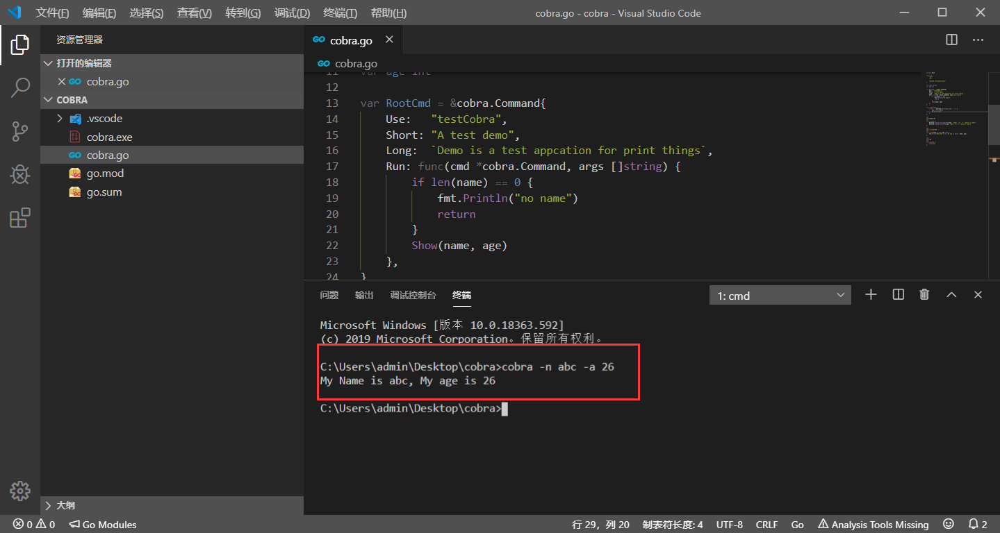
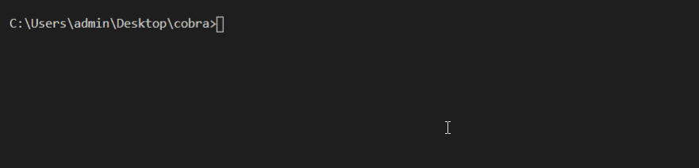

本页目录：
- 1、[看效果](#go-01)
- 2、[写代码](#go-02)

***


## 效果显示 <a name="go-01" href="#" >:house:</a>

> 制作成cmd的命令

```
cobra -n abc -a 26
```



## 写代码 <a name="go-02" href="#" >:house:</a>

> 写代码

<details>
<summary>代码</summary>

```go
package main
 
import (
	"fmt"
	"os"
 
	"github.com/spf13/cobra"
)

/**
*作用：定义标志
**/
var name string
var age int
var rootCmd = &cobra.Command{
	//三个是不同场景下的说明
	Use:   "testCobra",
	Short: "A test demo",
	Long:  `Demo is a test appcation for print things`,

	//执行的函数
	Run: func(cmd *cobra.Command, args []string) {
		//判断输入命令的-n 值是否为空
		if len(name) == 0 {
			fmt.Println("no name")
			return
		}
		fmt.Printf("My Name is %s, My age is %d\n", name, age)
	},
}
 
/**
*作用：注册命令
**/
func init() {
	//设置标志
	rootCmd.Flags().StringVarP(&name, "name", "n", "", "person's name")
	rootCmd.Flags().IntVarP(&age, "age", "a", 0, "person's age")
}

/**
*作用：将所有子命令添加到根命令集标志
**/
func Execute() {
	if err := rootCmd.Execute(); err != nil {
		fmt.Println(err)
		os.Exit(-1)
	}
}
/**
*作用：主函数
**/
func main() {
	Execute()
}
```

</details>

> 运行

```
set GO111MODULE=on
set GOPROXY=https://goproxy.io

go mod init cobra
go mod tidy


go run cobra.go -n ccc -a 28
```



> 编译

```
go build cobra.go
```
