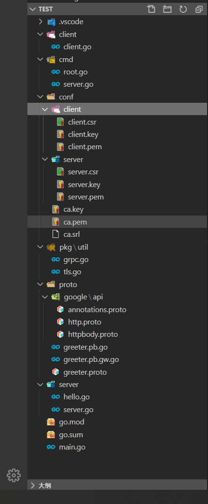
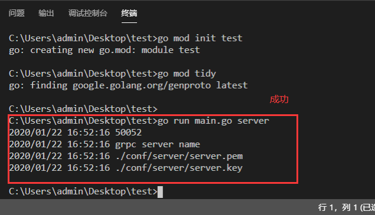
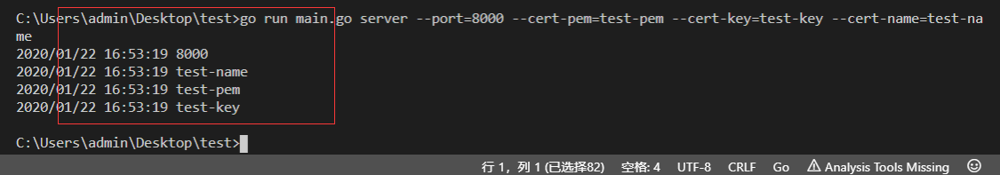

总操作流程
- 1、[制作证书](#go-01)
- 2、[编写cmd模块](#go-02)
- 3、[编辑server模块](#go-03)
- 4、[测试](#go-04)

***

- 项目目录



## 制作证书 <a name="go-01" href="#" >:house:</a>


- 1、ca。在test项目下创建conf的文件夹

```shell
# 运行cmd，进入conf的文件夹下
openssl genrsa -out ca.key 2048

openssl req -new -x509 -days 7200 -key ca.key -out ca.pem

# 填写信息时，需要这个Common Name写到客户端那里
Common Name (eg, fully qualified host name) []:DK_Li

```

- 2、server。在test项目conf的文件夹下创建server文件夹
```shell
# 运行cmd，进入conf/server的文件夹下
cd server

# 私钥，自动生成server.key
openssl ecparam -genkey -name secp384r1 -out server.key

# 生成 CSR
openssl req -new -key server.key -out server.csr

# 填写信息时，需要这个Common Name写到客户端那里
Common Name (eg, fully qualified host name) []:DK_Li

# 基于 CA 签发
openssl x509 -req -sha256 -CA ../ca.pem -CAkey ../ca.key -CAcreateserial -days 3650 -in server.csr -out server.pem


```

- 3、client。在test项目conf的文件夹下创建client文件夹
```shell
# 运行cmd，进入conf/client的文件夹下
cd client
# 私钥，自动生成client.key
openssl ecparam -genkey -name secp384r1 -out client.key

# 生成 CSR
openssl req -new -key client.key -out client.csr

# 填写信息时，需要这个Common Name写到客户端那里
Common Name (eg, fully qualified host name) []:DK_Li

# 基于 CA 签发
openssl x509 -req -sha256 -CA ../ca.pem -CAkey ../ca.key -CAcreateserial -days 3650 -in client.csr -out client.pem


```


## 编写cmd模块 <a name="go-02" href="#" >:house:</a>

- 在test项目下创建文件夹proto/google

> 1、下载google的api

[](https://github.com/grpc-ecosystem/grpc-gateway)

- 将third_party/googleapis/google/api下载，放到test项目的proto/google文件夹下

> 2、编写proto文件

- 在test项目的proto文件夹下新增greeter.proto文件

```go
syntax = "proto3";

package proto;

import "google/api/annotations.proto";

service HelloWorld {
    rpc SayHelloWorld(HelloWorldRequest) returns (HelloWorldResponse) {
        option (google.api.http) = {
            post: "/hello_world"
            body: "*"
        };
    }
}

message HelloWorldRequest {
    string referer = 1;
}

message HelloWorldResponse {
    string message = 1;
}
```

- 编译

```shell
# 进入proto目录下，在shell输入命令

cd proto

protoc -I .  --go_out=plugins=grpc:. greeter.proto

protoc --grpc-gateway_out=logtostderr=true:. greeter.proto
```

> 3、编写cmd模块

- 在test项目创建server文件夹，并且新建server.go文件

```go
package server

import (
    "log"
)

var (
    ServerPort string
    CertName string
    CertPemPath string
    CertKeyPath string
)

func Serve() (err error){
    log.Println(ServerPort)

    log.Println(CertName)

    log.Println(CertPemPath)

    log.Println(CertKeyPath)

    return nil
}
```

- 在test项目创建cmd文件夹，并且新建root.go文件

```go
package cmd

import (
    "fmt"
    "os"

    "github.com/spf13/cobra"
)

var rootCmd = &cobra.Command{
    Use:   "grpc",
    Short: "Run the gRPC hello-world server",
}

func Execute() {
    if err := rootCmd.Execute(); err != nil {
        fmt.Println(err)
        os.Exit(-1)
    }
}
```

- 在cmd文件夹下新建server.go文件

```go
package cmd

import (
    "log"

    "github.com/spf13/cobra"

    "test/server"
)

var serverCmd = &cobra.Command{
    Use:   "server",
    Short: "Run the gRPC hello-world server",
    Run: func(cmd *cobra.Command, args []string) {
        defer func() {
            if err := recover(); err != nil {
                log.Println("Recover error : %v", err)
            }
        }()

        server.Serve()
    },
}

func init() {
    serverCmd.Flags().StringVarP(&server.ServerPort, "port", "p", "50052", "server port")
    serverCmd.Flags().StringVarP(&server.CertPemPath, "cert-pem", "", "./conf/server/server.pem", "cert pem path")
    serverCmd.Flags().StringVarP(&server.CertKeyPath, "cert-key", "", "./conf/server/server.key", "cert key path")
    serverCmd.Flags().StringVarP(&server.CertName, "cert-name", "", "DK_Li", "server's hostname")//这里的DK_Li是认证时填入的信息
    rootCmd.AddCommand(serverCmd)
}

```

- 在test项目根目录下 新建main.go

```go
package main

import (
    "test/cmd"
)

func main() {
    cmd.Execute()
}
```

> 4、测试

```shell
# cmd 进到test根目录

set GO111MODULE=on
set GOPROXY=https://goproxy.io

go mod init test
go mod tidy

go run main.go server
```




```shell
go run main.go server --port=8000 --cert-pem=test-pem --cert-key=test-key --cert-name=test-name
```



## 编辑server模块 <a name="go-03" href="#" >:house:</a>

> 创建工具类。在test项目下创建文件夹pkg/util

- grpc.go

```go
package util

import (
    "net/http"
    "strings"

    "google.golang.org/grpc"
)

func GrpcHandlerFunc(grpcServer *grpc.Server, otherHandler http.Handler) http.Handler {
    if otherHandler == nil {
        return http.HandlerFunc(func(w http.ResponseWriter, r *http.Request) {
            grpcServer.ServeHTTP(w, r)
        })
    }
    return http.HandlerFunc(func(w http.ResponseWriter, r *http.Request) {
        if r.ProtoMajor == 2 && strings.Contains(r.Header.Get("Content-Type"), "application/grpc") {
            grpcServer.ServeHTTP(w, r)
        } else {
            otherHandler.ServeHTTP(w, r)
        }
    })
}
```

- tls.go

```go
package util

import (
    "crypto/tls"
    "io/ioutil"
    "log"

    "golang.org/x/net/http2"
)

func GetTLSConfig(certPemPath, certKeyPath string) *tls.Config {
    var certKeyPair *tls.Certificate
    cert, _ := ioutil.ReadFile(certPemPath)
    key, _ := ioutil.ReadFile(certKeyPath)

    pair, err := tls.X509KeyPair(cert, key)
    if err != nil {
        log.Println("TLS KeyPair err: %v\n", err)
    }

    certKeyPair = &pair

    return &tls.Config{
        Certificates: []tls.Certificate{*certKeyPair},
        NextProtos:   []string{http2.NextProtoTLS},
    }
}
```

> 在test项目的server文件夹下新增文件hello.go

```go
package server

import (
    "golang.org/x/net/context"

    pb "test/proto"
)

type helloService struct{}

func NewHelloService() *helloService {
    return &helloService{}
}

func (h helloService) SayHelloWorld(ctx context.Context, r *pb.HelloWorldRequest) (*pb.HelloWorldResponse, error) {
    return &pb.HelloWorldResponse{
        Message : "test",
    }, nil
}
```

> 修改在test项目的server文件夹下文件server.go

```go
package server

import (
    "crypto/tls"
    "net"
    "net/http"
    "log"

    "golang.org/x/net/context"
    "google.golang.org/grpc"
    "google.golang.org/grpc/credentials"
    "github.com/grpc-ecosystem/grpc-gateway/runtime"

    pb "test/proto"
    "test/pkg/util"
)

var (
    ServerPort string
    CertName string
    CertPemPath string
    CertKeyPath string
    EndPoint string
)

func Serve() (err error){
    EndPoint = ":" + ServerPort
    conn, err := net.Listen("tcp", EndPoint)
    if err != nil {
        log.Printf("TCP Listen err:%v\n", err)
    }

    tlsConfig := util.GetTLSConfig(CertPemPath, CertKeyPath)
    srv := createInternalServer(conn, tlsConfig)

    log.Printf("gRPC and https listen on: %s\n", ServerPort)

    if err = srv.Serve(tls.NewListener(conn, tlsConfig)); err != nil {
        log.Printf("ListenAndServe: %v\n", err)
    }

    return err
}

func createInternalServer(conn net.Listener, tlsConfig *tls.Config) (*http.Server) {
    var opts []grpc.ServerOption

    // grpc server
    creds, err := credentials.NewServerTLSFromFile(CertPemPath, CertKeyPath)
    if err != nil {
        log.Printf("Failed to create server TLS credentials %v", err)
    }

    opts = append(opts, grpc.Creds(creds))
    grpcServer := grpc.NewServer(opts...)

    // register grpc pb
    pb.RegisterHelloWorldServer(grpcServer, NewHelloService())

    // gw server
    ctx := context.Background()
    dcreds, err := credentials.NewClientTLSFromFile(CertPemPath, CertName)
    if err != nil {
        log.Printf("Failed to create client TLS credentials %v", err)
    }
    dopts := []grpc.DialOption{grpc.WithTransportCredentials(dcreds)}
    gwmux := runtime.NewServeMux()

    // register grpc-gateway pb
    if err := pb.RegisterHelloWorldHandlerFromEndpoint(ctx, gwmux, EndPoint, dopts); err != nil {
        log.Printf("Failed to register gw server: %v\n", err)
    }

    // http服务
    mux := http.NewServeMux()
    mux.Handle("/", gwmux)

    return &http.Server{
        Addr:      EndPoint,
        Handler:   util.GrpcHandlerFunc(grpcServer, mux),
        TLSConfig: tlsConfig,
    }
}
```

> 在test项目下创建文件夹client，并且创建文件client.go

```go
package main

import (
    "log"

    "golang.org/x/net/context"
    "google.golang.org/grpc"
    "google.golang.org/grpc/credentials"

    pb "test/proto"
)

func main() {
    creds, err := credentials.NewClientTLSFromFile("../conf/server/server.pem", "DK_Li")//这里的DK_Li是认证时填入的信息
    if err != nil {
        log.Println("Failed to create TLS credentials %v", err)
    }
    conn, err := grpc.Dial(":50052", grpc.WithTransportCredentials(creds))
    defer conn.Close()

    if err != nil {
        log.Println(err)
    }

    c := pb.NewHelloWorldClient(conn)
    context := context.Background()
    body := &pb.HelloWorldRequest{
        Referer : "Grpc",
    }

    r, err := c.SayHelloWorld(context, body)
    if err != nil {
        log.Println(err)
    }

    log.Println(r.Message)
}
```

## 测试 <a name="go-04" href="#" >:house:</a>

> 运行

```
# 运行cmd，进入test文件夹下运行命令
go run main.go server

# 运行另一个cmd，进入test文件夹下运行命令
go run client.go
```

- 成标志返回test


> 接口测试

```
# 运行Git Bash here

curl -X POST -k https://localhost:50052/hello_world -d '{"referer": "restful_api"}'

```


- 成功标志

返回：{"message":"test"}