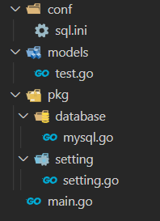

总操作流程：
- 1、[docker配置mysql](#go-01)
- 1、[写代码](#go-02)
- 2、[测试](#go-03)

***

## docker配置mysql <a name="go-01" href="#" >:house:</a>

### docker下载安装mysql

> 1、下拉mysql

```
docker pull mysql:8.0.18
```

> 2、创建mysql容器

```
docker run --privileged=true --name test_mysql -v /usr/mysql:/var/lib/mysql -p 3306:3306 -e MYSQL_ROOT_PASSWORD=123456 -d mysql:8.0.18
```

> 3、防火墙开放端口

```
firewall-cmd --permanent --zone=public --add-port=3306/tcp
firewall-cmd --reload
```

### 配置mysql

> 进入容器中: docker exec -it test_mysql /bin/bash  
> 连接mysql: mysql -u root -p
> 配置mysql:

<details>
<summary>mysql命令</summary>

```sql
CREATE USER 'test_mysql'@'%' IDENTIFIED BY '123456';
flush privileges;

-- 创建数据库
create database test;
GRANT all privileges ON test.* TO 'test_mysql'@'%' WITH GRANT OPTION;
flush privileges; 

-- 修改加密规则
ALTER USER 'test_mysql'@'%' IDENTIFIED BY '123456' PASSWORD EXPIRE NEVER;

-- 更新一下用户的密码 
ALTER USER 'test_mysql'@'%' IDENTIFIED WITH mysql_native_password BY '123456';
FLUSH PRIVILEGES;

-- 再重置下密码
alter user 'test_mysql'@'%' identified by '123456';
FLUSH PRIVILEGES;
quit;
```

</details>

## 写代码 <a name="go-02" href="#" >:house:</a>

- 项目目录



### 建表&添加数据

> 建表

<details>
<summary>sql</summary>

```sql
use test;

CREATE table tests(
	id INT(11) primary key not null auto_increment,
	name VARCHAR(25),
	age int,
	birthday date
);

INSERT into tests VALUES (1,"张三",15,'2020-05-03');
INSERT into tests VALUES (2,"李四",16,'2020-04-03');
INSERT into tests VALUES (3,"李光",17,'2020-03-03');
```

</details>

### 写程序

> sql.ini

```js
[database]
Type = mysql
User = test_mysql
Password = 123456
Host = 192.168.42.128:3306
Name = test
```

> models\test.go

<details>
<summary>代码</summary>

```go
package models

import (
	"github.com/jinzhu/gorm"
	"time"
	orm "test/pkg/database"
)

type Test struct {
	ID int
	Name string 
	Age int
	Birthday time.Time
}


/**
*作用：通过年龄查询tests表的数据
*/
func GetTest(age int) (*Test, error) {
	var test Test
	err := orm.Eloquent.Where("age =?", age).First(&test).Error
	if err != nil && err != gorm.ErrRecordNotFound {
		return nil, err
	}
	return &test, nil
}
```

</details>

> pkg\database\mysql.go

<details>
<summary>代码</summary>

```go
package database

 import (
	 "fmt"
	 "log"
 
	 "github.com/jinzhu/gorm"
	 _ "github.com/jinzhu/gorm/dialects/mysql"
	 "test/pkg/setting"
 )
 
 
 var Eloquent *gorm.DB
 
 func init() {
	 var err error
 
	 Eloquent, err = gorm.Open(setting.DatabaseSetting.Type, fmt.Sprintf("%s:%s@tcp(%s)/%s?charset=utf8&parseTime=True&loc=Local",
		 setting.DatabaseSetting.User,
		 setting.DatabaseSetting.Password,
		 setting.DatabaseSetting.Host,
		 setting.DatabaseSetting.Name))
	 if err != nil {
		 log.Fatalf("mysql connect error : %v", err)
	 }
 
	 if Eloquent.Error != nil {
		 log.Fatalf("database error: %v", Eloquent.Error)
	 }
 
 }
```

</details>

> pkg\setting\setting.go

<details>
<summary>代码</summary>

```go
package setting

 import (
	 "log"
	 "github.com/go-ini/ini"
 )
 
 type Database struct {
	 Type        string
	 User        string
	 Password    string
	 Host        string
	 Name        string
 }
 
 var DatabaseSetting = &Database{}
 
 var cfg *ini.File
 
 func init() {
	 var err error
	 cfg, err = ini.Load("conf/sql.ini")
	 if err != nil {
		 log.Fatalf("setting.Setup, fail to parse 'conf/sql.ini': %v", err)
	 }
 
	 mapTo("database", DatabaseSetting)
 
 }
 
 func mapTo(section string, v interface{}) {
	 err := cfg.Section(section).MapTo(v)
	 if err != nil {
		 log.Fatalf("Cfg.MapTo RedisSetting err: %v", err)
	 }
 }
```

</details>

> main.go

<details>
<summary>代码</summary>

```go
package main

 import (
	 "log"
	 "fmt"
	 "test/models"
	 orm "test/pkg/database"
 )
 func main() {
   defer orm.Eloquent.Close()
   
   test,err := models.GetTest(15)
   //查询一条数据
   if err != nil {
	 log.Fatalf("查询数据失败: %v",err)
	 return
   }
   fmt.Println("查询数据成功")
   fmt.Println(test.Name)
 }
```

</details>

## 测试 <a name="go-03" href="#" >:house:</a>

```
set GO111MODULE=on
set GOPROXY=https://goproxy.io

go mod init test
go mod tidy

go run main.go
```