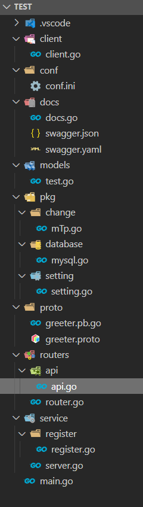
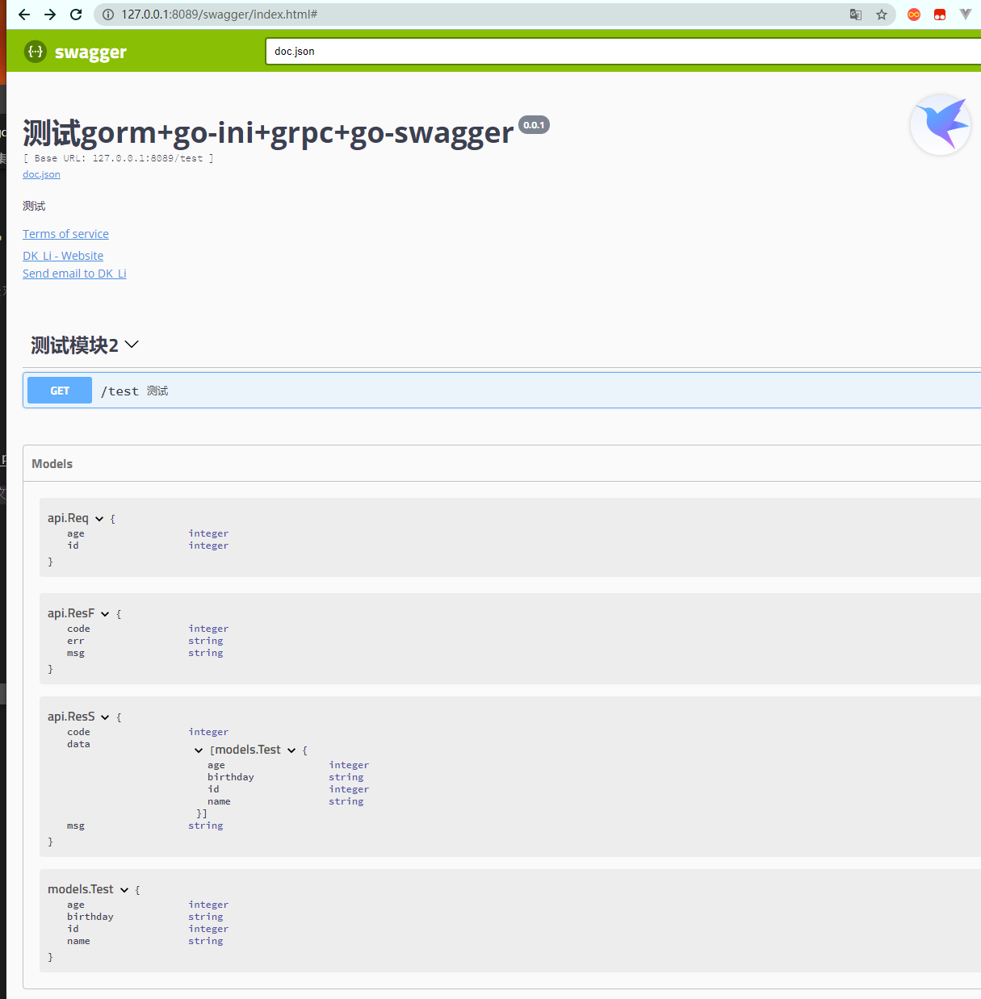

总操作流程：
- 1、[写代码](#go-01)
- 2、[测试](#go-02)

***

> 注意：该教程数据库数据go之gorm+go-ini+grpc+gin一样

## 写代码 <a name="go-01" href="#" >:house:</a>

- 项目目录



## 测试 <a name="go-02" href="#" >:house:</a>

> conf\conf.ini

```js
[database]
Type = mysql
User = test_mysql
Password = 123456
Host = 192.168.42.128:3306
Name = test

[grpcserver1]
Port = 8080
```

> pkg\change\mTp.go

<details>
<summary>代码</summary>

```go
/*
 * @Descripttion: 将mysql的models装pd格式
 * @version: 0.1
 * @Author: DK_Li
 * @Date: 2020-05-09 16:18:49
 * @LastEditors: DK_Li
 * @LastEditTime: 2020-05-10 23:44:41
 */
 package change

 import(
	 "test/models"
	 proto "test/proto"
 )

 func ModeltoProto(test []models.Test) (* proto.SearchResponse){
	
		a:=&proto.SearchResponse{}
		for i := 0; i <len(test); i++ {
			b :=proto.Test{
				Id: test[i].ID,
				Name: test[i].Name,
				Age: test[i].Age,
				Birthday: test[i].Birthday,
			}
			
			a.Response=append(a.Response,&b)
		}
		return a
 }
```

</details>

> pkg\database\mysql.go

<details>
<summary>代码</summary>

```go
/*
 * @Descripttion: 连接mysql
 * @version: 0.1
 * @Author: DK_Li
 * @Date: 2020-02-12 13:50:34
 * @LastEditors: DK_Li
 * @LastEditTime: 2020-05-04 20:23:26
 */
 package database

import (
	"fmt"
	"log"

	"github.com/jinzhu/gorm"
	_ "github.com/jinzhu/gorm/dialects/mysql"
	"test/pkg/setting"
)


var Eloquent *gorm.DB

func init() {
	var err error
	Eloquent, err = gorm.Open(setting.DatabaseSetting.Type, fmt.Sprintf("%s:%s@tcp(%s)/%s?charset=utf8&parseTime=True&loc=Local",
		setting.DatabaseSetting.User,
		setting.DatabaseSetting.Password,
		setting.DatabaseSetting.Host,
		setting.DatabaseSetting.Name))
	if err != nil {
		log.Fatalf("mysql connect error : %v", err)
	}

	if Eloquent.Error != nil {
		log.Fatalf("database error: %v", Eloquent.Error)
	}

}
```

</details>

> pkg\setting\setting.go

<details>
<summary>代码</summary>

```go
/*
 * @Descripttion: 读取conf.ini
 * @version: 0.1
 * @Author: DK_Li
 * @Date: 2020-02-10 15:12:17
 * @LastEditors: DK_Li
 * @LastEditTime: 2020-05-04 21:40:39
 */
 package setting

 import (
	 "log"
	 "github.com/go-ini/ini"
 )
 
 type Database struct {
	 Type        string
	 User        string
	 Password    string
	 Host        string
	 Name        string
 }
 
 var DatabaseSetting = &Database{}
 
 type GrpcServer1 struct {
	 Port        string
 }
 
 var GrpcServerSetting = &GrpcServer1{}
 
 
 var cfg *ini.File
 
 func init() {
	 var err error
	 cfg, err = ini.Load("conf/conf.ini")
	 if err != nil {
		 log.Fatalf("setting.Setup, fail to parse 'conf/conf.ini': %v", err)
	 }
 
	 mapTo("database", DatabaseSetting)
	 mapTo("grpcserver1",GrpcServerSetting)
 
 }
 
 func mapTo(section string, v interface{}) {
	 err := cfg.Section(section).MapTo(v)
	 if err != nil {
		 log.Fatalf("Cfg.MapTo RedisSetting err: %v", err)
	 }
 }
```

</details>

> models\test.go

<details>
<summary>代码</summary>

```go
/*
 * @Descripttion: 对数据的操作
 * @version: 0.1
 * @Author: DK_Li
 * @Date: 2020-05-03 20:16:20
 * @LastEditors: DK_Li
 * @LastEditTime: 2020-05-10 00:38:28
 */

package models

import (
	"github.com/jinzhu/gorm"
	orm "test/pkg/database"
)

type Test struct {
	ID int32
	Name string
	Age int32
	Birthday string 
}


/**
*作用：通过年龄查询tests表的数据
*/
func GetTest(age int32) ([]Test, error) {
	var test []Test
	err := orm.Eloquent.Where("age =?", age).Find(&test).Error
	if err != nil && err != gorm.ErrRecordNotFound {
		return nil, err
	}
	return test, nil
}
```

</details>

> routers\api\api.go

<details>
<summary>代码</summary>

```go
/*
 * @Descripttion: gin的api
 * @version: 0.1
 * @Author: DK_Li
 * @Date: 2020-02-10 16:16:16
 * @LastEditors: DK_Li
 * @LastEditTime: 2020-05-14 08:15:04
 */

 package api

 import (
	 "log"
	 "context"
	 "net/http"
	 "github.com/gin-gonic/gin"
	 proto "test/proto"
	 cs "test/client"
	 "test/models"
 )

 type Req struct {
	ID int32
	Age int32
}

type ResS struct {
    Code int 
    Data []models.Test
    Msg string 
}

type ResF struct {
    Code int 
    err string
    Msg string 
}
 
// @Summary 测试
// @Description 通过接收id和年龄，返回数据集
// @Tags 测试模块2
// @Accept  json
// @Produce json
// @Param req body api.Req true "id和年龄"
// @Success 200 {object}  api.ResS "Success"
// @Failure 500 {object}  api.ResF "Failure"
// @Router /test [GET]
 func Test(c *gin.Context) {
	var req Req
	err := c.BindJSON(&req)
	if err != nil{
	   c.String(http.StatusOK,"%v","test bind error:%v",err)
	}
	 client,err := cs.GetGrpcClient(":8080")
	 if err != nil {
		 log.Fatalf("client.Search err: %v", err)
	 }
	 resp, err := client.Search(context.Background(), &proto.SearchRequest{
		 Request: req.Age,
	 })
	 if err != nil {
		 log.Fatalf("client.Search err: %v", err)
		 c.JSON(http.StatusInternalServerError, gin.H{                                                 
			"code":-1,
			"err": err,
			"msg": "Failure",
		})
		 return
	 }
	
	 c.JSON(http.StatusOK, gin.H{
        "Code":1,
        "Data":resp.Response,
        "Msg":"Success",
    })
	 
 }
```

</details>

> routers\router.go

<details>
<summary>代码</summary>

```go
/*
 * @Descripttion: gin的路由
 * @version: 0.1
 * @Author: DK_Li
 * @Date: 2020-02-10 16:15:52
 * @LastEditors: DK_Li
 * @LastEditTime: 2020-05-04 22:45:53
 */

 package routers
 
 import (
	 "github.com/gin-gonic/gin"
	 . "test/routers/api"
 )
  
 func InitRouter() *gin.Engine {
	 router := gin.Default()
  
	 router.GET("/test", Test)
  
	 return router
 }
```

</details>

> service\register\register.go

<details>
<summary>代码</summary>

```go
/*
 * @Descripttion: 服务端的接口和注册
 * @version: 0.1
 * @Author: DK_Li
 * @Date: 2020-05-04 20:24:46
 * @LastEditors: DK_Li
 * @LastEditTime: 2020-05-10 23:46:54
 */
package register

import(
	"log"
	"context"
	"google.golang.org/grpc"
	proto "test/proto"
	"test/models"
	change "test/pkg/change"

)

type SearchService struct {}

/**
 * @description: 服务端的接口
 * @param {type} 
 * @return: 
 */
func(s * SearchService) Search(ctx context.Context, r * proto.SearchRequest)( * proto.SearchResponse, error) {
	test,err := models.GetTest(r.GetRequest())
	//查询一条数据
	if err != nil {
		log.Fatalf("查询数据失败: %v", err)
	}
	
	mtp :=change.ModeltoProto(test)
	return &proto.SearchResponse {
		Response: mtp.Response,
	},
	nil
}


/**
 * @description: 服务端的注册
 * @param {type} 
 * @return: 
 */
func ServiceReg(server * grpc.Server) {
	proto.RegisterSearchServiceServer(server, & SearchService {})

}
```

</details>

> service\server.go

<details>
<summary>代码</summary>

```go
/*
 * @Descripttion: 服务端的启动文件
 * @version: 0.1
 * @Author: DK_Li
 * @Date: 2020-05-04 20:25:10
 * @LastEditors: DK_Li
 * @LastEditTime: 2020-05-06 22:21:02
 */
 package main
 
 import (
	 "log"
	 "net"
	 "google.golang.org/grpc"
	 "test/service/register"
	 "test/pkg/setting"
 )
 
 func main() {
	 //创建 Listen，监听 TCP 端口
	 lis, err := net.Listen("tcp", ":"+setting.GrpcServerSetting.Port)
	 if err != nil {
		 log.Fatalf("net.Listen err: %v", err)
	 }
	 //创建 gRPC Server 对象
	 server := grpc.NewServer()
	 //将 SearchService注册到 gRPC Server 的内部注册中心
	 register.ServiceReg(server)
	 if err := server.Serve(lis); err != nil {
		 log.Fatalf("failed to serve: %v", err)
	 }
 }
```

</details>

> client\client.go

<details>
<summary>代码</summary>

```go
/*
 * @Descripttion: grpc的客户端连接服务端复用方法
 * @version: 0.1
 * @Author: DK_Li
 * @Date: 2020-02-11 18:39:15
 * @LastEditors: DK_Li
 * @LastEditTime: 2020-05-04 21:17:05
 */

 package client

 import (
	 "google.golang.org/grpc"
	 "sync"
	 "sync/atomic"
	 "unsafe"
	 proto "test/proto"
 )
  
 var (
	 globalClientConn unsafe.Pointer
	 lck              sync.Mutex
 )
 
 /**
  * @description: 创建 SearchService 的客户端对象
  * @param {type} 
  * @return: 
  */
 func GetGrpcClient(target string) (proto.SearchServiceClient, error) {  //返回需要的client
	 conn, err := GetGrpcConn(target)
	 if err != nil {
		 return (proto.SearchServiceClient)(nil), err
	 }
	 return proto.NewSearchServiceClient(conn), nil  //此处调用pb.go文件中生成的创建client的方法
 }
 
 
 func GetGrpcConn(target string) (*grpc.ClientConn, error) {
	 if atomic.LoadPointer(&globalClientConn) != nil {
		 return (*grpc.ClientConn)(globalClientConn), nil
	 }
	 lck.Lock()
	 defer lck.Unlock()
	 if atomic.LoadPointer(&globalClientConn) != nil { //double check
		 return (*grpc.ClientConn)(globalClientConn), nil
	 }
	 cli, err := NewGrpcConn(target)
	 if err != nil {
		 return nil, err
	 }
	 atomic.StorePointer(&globalClientConn, unsafe.Pointer(cli))
	 return cli, nil
 }
 
 /**
  * @description: 连接服务端
  * @param {type} 
  * @return: 
  */
 func NewGrpcConn(target string) (*grpc.ClientConn,error){
	 conn, err := grpc.Dial(target, grpc.WithInsecure())
	 if err != nil {
		 return nil, err
	 }
	 return conn, err
 }
```

</details>

> main.go

<details>
<summary>代码</summary>

```go
/*
 * @Descripttion: 客户端的启动文件
 * @version: 0.1
 * @Author: DK_Li
 * @Date: 2020-05-03 20:16:35
 * @LastEditors: DK_Li
 * @LastEditTime: 2020-05-14 05:03:35
 */

 package main

 import (
	 "log"
	 "test/routers"
	 "github.com/swaggo/gin-swagger"
	 "github.com/swaggo/gin-swagger/swaggerFiles"
	 _ "test/docs"
 )
 

// @title 测试gorm+go-ini+grpc+gin+go-swagger
// @version 0.0.1
// @description  测试
// @BasePath /test
// @termsOfService http://github.com
// @contact.name DK_Li
// @contact.url http://www.xxxx.com
// @contact.name DK_Li
// @contact.email ×××@qq.com
// @host 127.0.0.1:8089
 func main() {
 
	 router := routers.InitRouter()
	 //访问swagger文档：http://localhost:8089/swagger/index.html
	 router.GET("/swagger/*any", ginSwagger.WrapHandler(swaggerFiles.Handler))

	 // 启动并监听8089端口
	 if err := router.Run(":8089"); err != nil {
		log.Fatalf("could not run server: %v", err)
	 }
 
 }
```

</details>

- 生成swagger的接口文档

```shell
# 每次修改注解后，都要重新编译文档
swag init
```

> proto\greeter.proto

<details>
<summary>代码</summary>

```go
syntax = "proto3";

package proto;

service SearchService {
  rpc Search(SearchRequest) returns(SearchResponse) {}
}

message SearchRequest {
  int32 request = 1;
}

message SearchResponse {
  repeated Test response = 1;
}

message Test {
  int32 id = 1;
  string name = 2;
  int32 age = 3;
  string birthday = 4;
}
```

</details>

- 编译

```js
# 进入proto目录下，在shell输入命令

cd proto

protoc -I . greeter.proto --go_out=plugins=grpc:.
```


# <a name="go-02" href="#" >测试:house:</a>

> 先运行服务端

```
set GO111MODULE=on
set GOPROXY=https://goproxy.io

go mod init test
go mod tidy

go run service/server.go
```

> 再运行客户端

```
go run main.go
```

> postman的get对json请求：http://localhost:8089/test

```json
{
	"id":1,
	"age":15
}
```

> 访问swagger文档：http://localhost:8089/swagger/index.html



