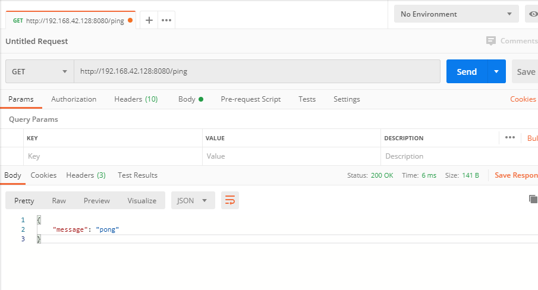

总操作流程：
- 1、[下载安装](#go-01)
- 2、[配置](#go-02)
- 3、[测试](#go-03)

***

> 该教程基于：02.go之docker部署go项目

# <a name="go-01" href="#" >下载安装</a>

> 下拉nginx

```shell
docker pull nginx:latest
```

> 安装docker-compose 

```
curl -L https://github.com/docker/compose/releases/download/1.23.2/run.sh > /usr/local/bin/docker-compose

chmod +x /usr/local/bin/docker-compose

docker-compose version 
```

# <a name="go-02" href="#" >配置</a>

> 创建文件夹和上传文件

```shell
mkdir -p /usr/local/docker-compose
mkdir -p /usr/local/go
mkdir -p /usr/local/nginx
mkdir -p /usr/local/go/logs
chmod 777 /usr/local/docker-compose /usr/local/go /usr/local/go/logs /usr/local/nginx

cd /usr/local/go/logs
touch error.log
touch access.log
chmod 777 error.log
chmod 777 access.log
```

> 创建nginx的配置文件

```shell
cd /usr/local/nginx
touch nginx.conf
chmod 777 nginx.conf
vim nginx.conf
```

```js
server {
        listen       80;
        server_name  localhost;

        charset utf-8;
        access_log  /usr/local/go/logs/access.log;

        location ~ \.(css|js|fonts|png|svg|html|txt)$ {
            access_log on;
            expires 1d;
            
            root "/usr/local/go";
            try_files $uri @backend;
        }

        location / {
            try_files /_not_exists_ @backend;
        }

        location @backend {
            proxy_set_header X-Forwarded-For $remote_addr;
            proxy_set_header Host            $http_host;
            proxy_pass http://192.168.42.128:8080;#ip一定是服务器的
        }
    }
```

> 创建docker-compose.yml

```shell
cd /usr/local/docker-compose
touch docker-compose.yml
chmod 777 docker-compose.yml
vim docker-compose.yml
```

```yml
version: "3"
services:
  nginx:
      image: nginx:latest
      container_name: nginx
      restart: always
      ports: 
        - "81:80"
      volumes:                                                            
        - /usr/local/go/logs/error.log:/usr/local/go/logs/error.log:rw
        - /usr/local/go/logs/access.log:/usr/local/go/logs/access.log:rw
        - /usr/local/nginx/nginx.conf:/etc/nginx/conf.d/default.conf:rw
      links:
        - "go"
      tty: true
  go:
    image: test:v1
    container_name: go
    restart: always
    ports: 
      - "8080:8080"
```
> 防火墙开放端口

```
firewall-cmd --permanent --zone=public --add-port=81/tcp
firewall-cmd --reload
```

# <a name="go-03" href="#" >测试</a>

> 启动

```shell
docker-compose up -d
```

> 使用postman测试接口：http://192.168.42.128:8080/ping

