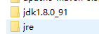

操作总流程：
- 1、[下载](#java-01) 
- 2、[配置](#java-02) 
- 3、[测试](#java-03) 

----------
## 下载 <a name="java-01" href="#" >:house:</a>

[](https://pan.baidu.com/s/1cK2mrhYYNE_Drv5NjzOBEw)


`注：安装时jdk和jre安装路径要分开，如图：`



## 配置 <a name="java-02" href="#" >:house:</a>

> 环境变量加： 

- 1，新建变量名：JAVA_HOME，变量值(软件存放的路径)：C:\Program Files\Java\jdk1.7.0
- 2，打开PATH，添加变量值：%JAVA_HOME%\bin;%JAVA_HOME%\jre\bin
- 3，新建变量名：CLASSPATH，变量值：.;%JAVA_HOME%\lib\dt.jar;%JAVA_HOME%\lib\tools.jar

## 测试 <a name="java-03" href="#" >:house:</a>

> 在cmd输入

```shell
java -version
```
