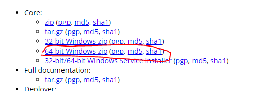
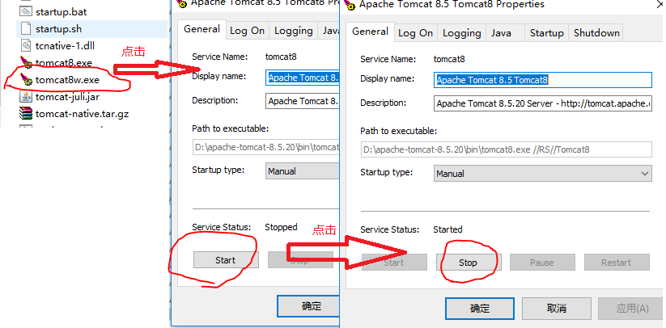
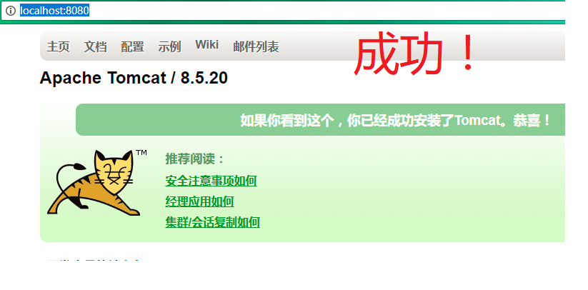

总操作流程：
- 1、[下载](#java-01) 
- 2、[配置](#java-02) 
- 3、[测试](#java-03) 

----------

## 下载 <a name="java-01" href="#" >:house:</a>
[](http://tomcat.apache.org/download-70.cgi)




## 配置 <a name="java-02" href="#" >:house:</a>

> 环境变量加：
- 1，新建变量名：CATALINA_BASE，变量值(软件存放的路径)：C:\tomcat
- 2，新建变量名：CATALINA_HOME，变量值(软件存放的路径)：C:\tomcat
- 3，打开PATH，在尾部添加变量值：;%CATALINA_HOME%\lib;%CATALINA_HOME%\bin



## 测试 <a name="java-03" href="#" >:house:</a>

```shell
catalina version
```

- 如果提示错误：Unable to open the service 'Tomcat7'。cmd进入bin文件夹下运行命令。

```shell
service.bat install
```


