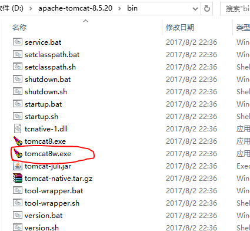
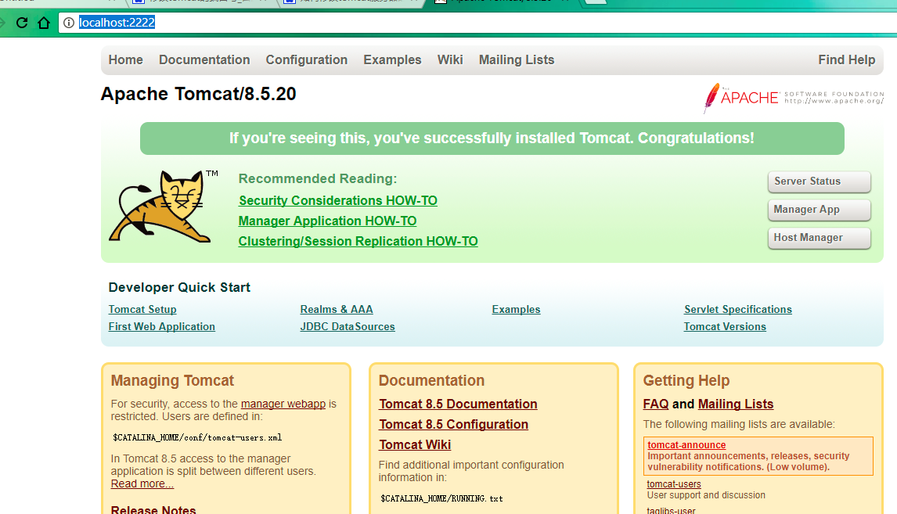

操作总流程：
- 1、[找到要修改的配置文件](#java-01)
- 2、[修改端口](#java-01)
- 3、[重启tomcat](#java-01)
- 4、[测试](#java-01)

----------
## 找到要修改的配置文件 <a name="java-01" href="#" >:house:</a>

> 打开tomcat所在的conf文件夹的server.xml文件

## 修改端口 <a name="java-02" href="#" >:house:</a>
> 找到等代码：Connector port="8080"......
> 将8080改为自己想改的端口，这里我改为2222保存退出；

## 重启tomcat <a name="java-03" href="#" >:house:</a>

## 测试 <a name="java-04" href="#" >:house:</a>

- 在浏览器输入：http://localhost:2222/

> 成功标准：

