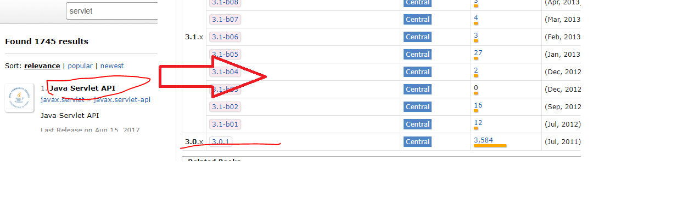

总操作流程：
- 1、[修改maven的包下载位置配置文件](#java-01)
- 2、[打开配置界面](#java-02)
- 3、[导入文件根目录](#java-03)

----------
## 修改maven的包下载位置配置文件 <a name="java-01" href="#" >:house:</a>

## 打开配置界面 <a name="java-02" href="#" >:house:</a>

> window > preferences > Maven

## 导入文件根目录 <a name="java-03" href="#" >:house:</a>

- installation > add > Dirctory...(maven本地安装的根目录)
- User Settings > Browse...(之前修改的maven的文件的根路径)
