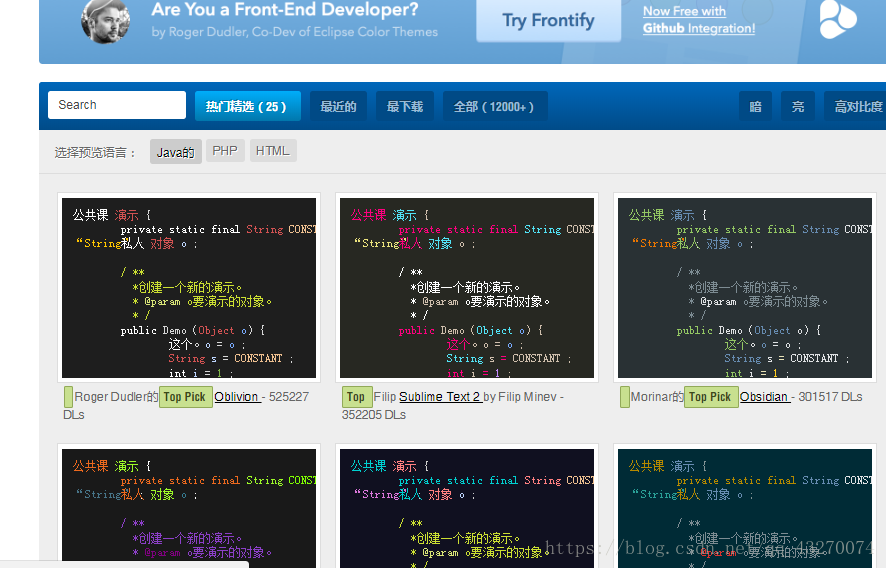
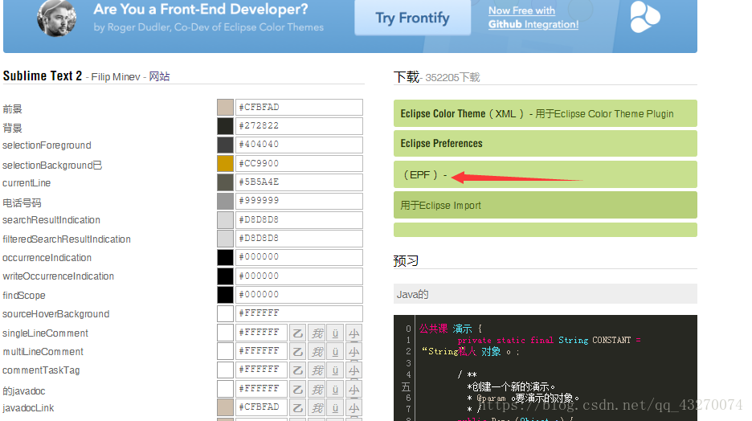

总操作流程：
- 1、[下载](#java-01)
- 2、[配置](#java-02)
- 3、[看效果](#java-03)

***

## 下载 

## 配置 

- file—>import选择General—>Preferences选择之前下载的epf文件—>Finish

- Windows——preferences——General——appearance——Theme 将Theme改为Dark即可

## 看效果 