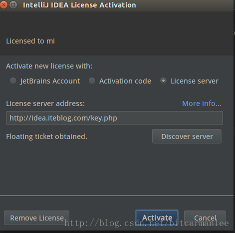

总操作流程：
- 1、[下载安装](#java-01) 
- 2、[破解](#java-02) 
- 3、[插件下载](#java-03) 

----------

## 下载安装 <a name="java-01" href="#" >:house:</a>

`建议下载：Version 2016.3的2016.3.8 for Windows ZIP Archive (zip)，为了保证破解有效`

[](https://www.jetbrains.com/idea/download/previous.html)


## 破解 <a name="java-02" href="#" >:house:</a>



- 破解：
在激活界面的License server输入：`http://idea.wrbugtest.tk/`

## 添加插件 <a name="java-03" href="#" >:house:</a>
```
File -> settings -> Plugins 即可调出设置中的插件选项。
```
- 参考：

[](https://www.zhihu.com/question/22437385)
