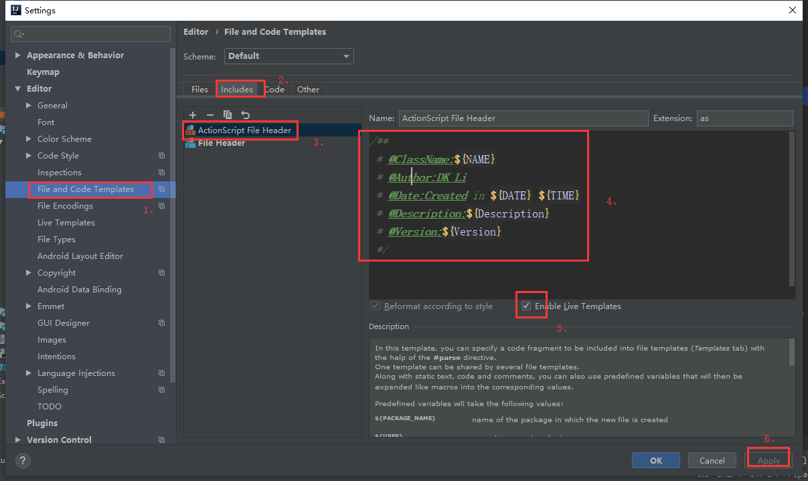
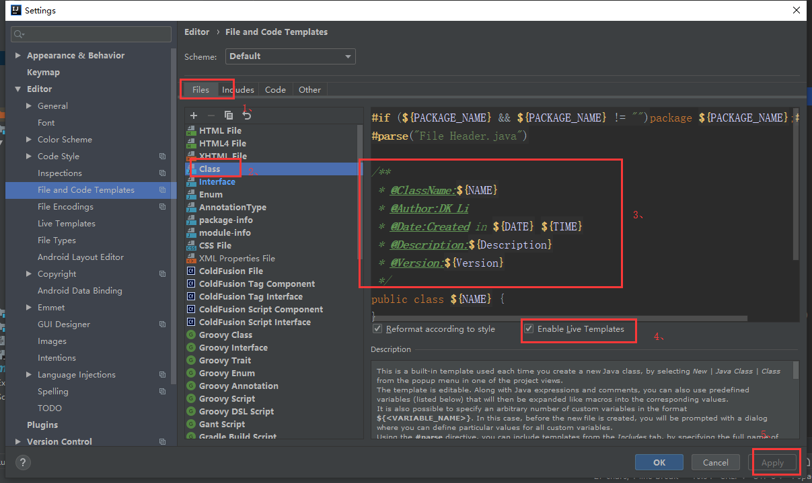
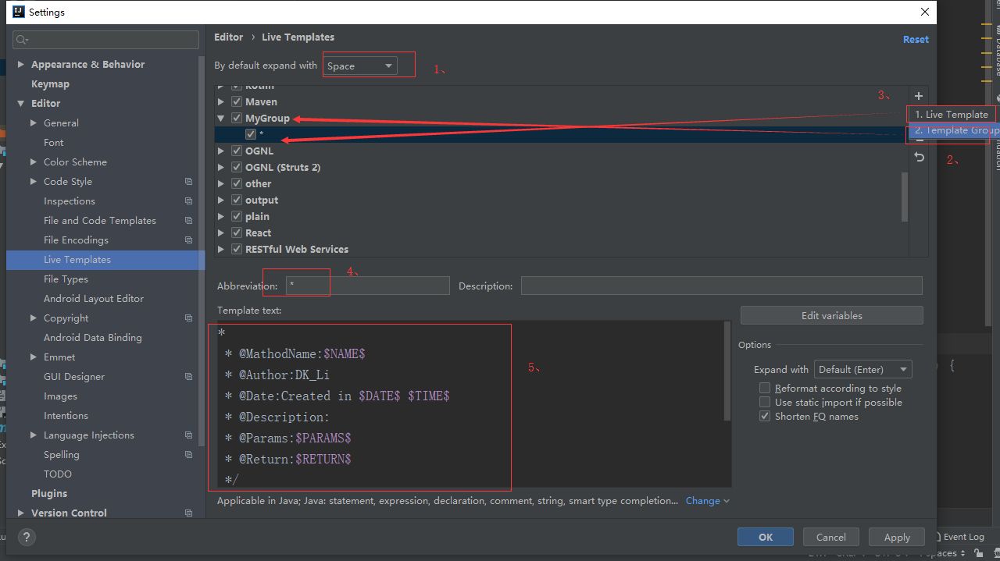
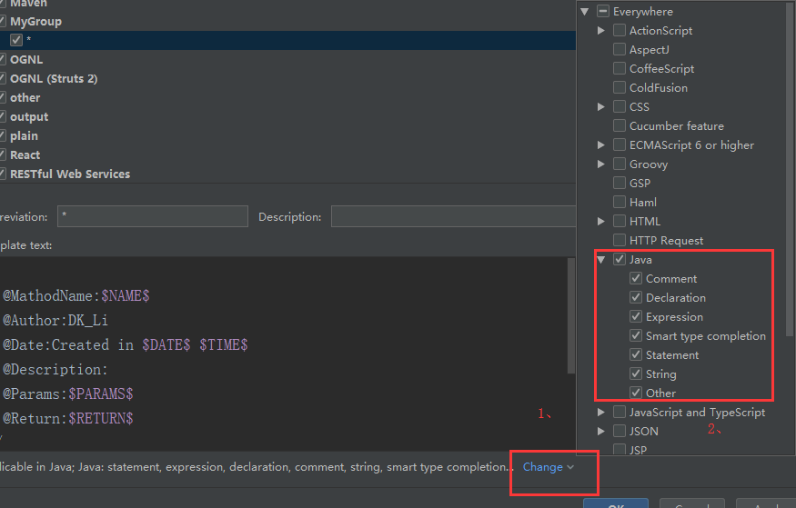
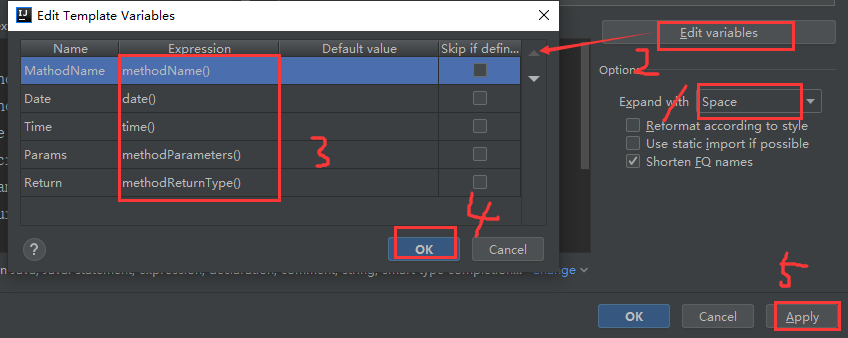

总操作流程：
- 1、配置
- 2、测试

***

## 配置

>类的配置

```java
/**
 * @ClassName:${NAME}
 * @Author:DK_Li
 * @Date:Created in ${DATE} ${TIME}
 * @Description:${Description}
 * @Version:${Version}
 */
```





> 接口的配置

```java
*
 * @MathodName:$MathodName$
 * @Author:DK_Li
 * @Date:Created in $Date$ $Time$
 * @Description:
 * @Params:$Params$
 * @Return:$Return$
 */
```







## 测试

>类和接口的测试直接新增可看到效果

>方法的接口输入/**+空格可以看到效果