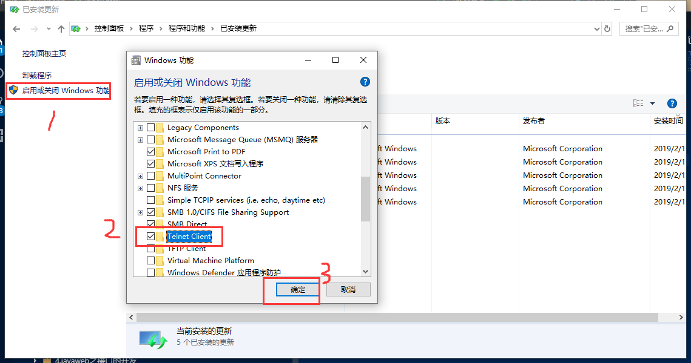

总操作流程：
- 1、[下载安装](#memcached-01)
- 2、[配置](#memcached-02)
- 3、[测试](#memcached-03)

***

## 下载安装 <a name="memcached-01" href="#" >:house:</a>

> 1、安装telnet



> 2、安装memcached

http://static.runoob.com/download/memcached-win64-1.4.4-14.zip


## 配置 <a name="memcached-02" href="#" >:house:</a>

- 解压后，cmd管理员进入，命令：C:\Software\memcached\memcached.exe -d install

- 删除命令:C:\Software\memcached\memcached.exe -d uninstall

- 开启命令：C:\Software\memcached\memcached.exe -d start

- 关闭命令：C:\Software\memcached\memcached.exe -d start

## 测试 <a name="memcached-03" href="#" >:house:</a>

```shell
telnet 127.0.0.1 11211
```
