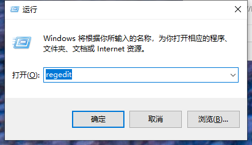
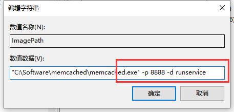

总操作流程：
- 1、[进入注册表](#memcached-01)
- 2、[修改配置文件](#memcached-02)
- 3、[测试](#memcached-03)

***

## 进入注册表 <a name="memcached-01" href="#" >:house:</a>

>regedit



## 修改配置文件 <a name="memcached-02" href="#" >:house:</a>

>计算机\HKEY_LOCAL_MACHINE\SYSTEM\CurrentControlSet\Services\memcached



## 测试 <a name="memcached-03" href="#" >:house:</a>

> cmd输入命令

```
telnet 127.0.0.1 8888
```