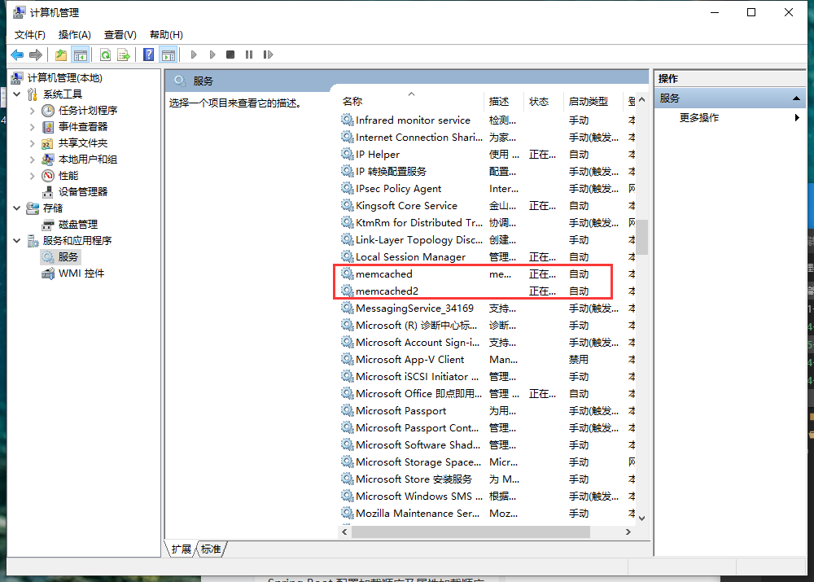

总操作流程：
- 1、[添加服务器](#memcached-01)
- 2、[启动服务](#memcached-02)
- 3、[测试](#memcached-03)

***

## 添加服务器 <a name="memcached-01" href="#" >:house:</a>

> 管理员身份运行cmd

```shell
sc create memcached2 binPath= "C:\Software\memcached\memcached.exe -d runservice  -m 128 -c 512 -p 6666" start= auto DisplayName= "memcached2"
```

## 启动服务 <a name="memcached-02" href="#" >:house:</a>



## 测试 <a name="memcached-03" href="#" >:house:</a>

> cmd输入命令

```
telnet 127.0.0.1 6666
```