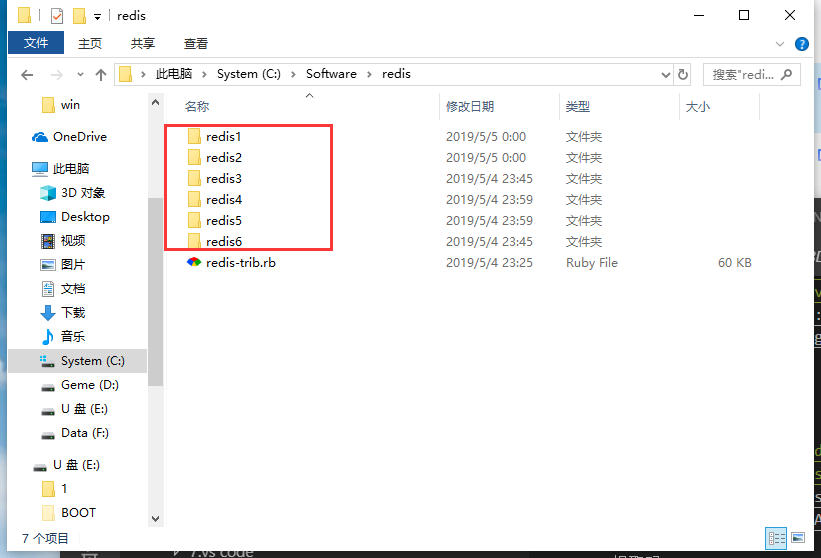
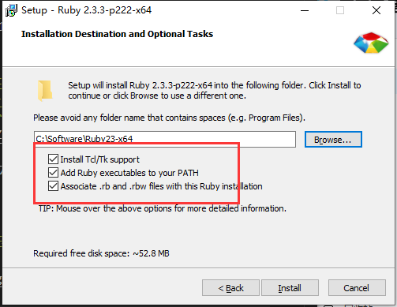

总操作流程：
- 1、下载安装
- 2、配置
- 3、测试

***

## 下载安装


> 1、下载

[](https://pan.baidu.com/s/1rCWvJ_0k0z1gNXo8EA8J7w)

提取码:yabv

[](https://pan.baidu.com/s/1xjMO3JbBFD-9PzV4C4vLCg)

提取码:zdg6

[](https://pan.baidu.com/s/1NfZgVO8NYfNyRkRicy9i8g)

提取码:w1ss


[](https://pan.baidu.com/s/1w2db6eZX1t29cdwKEPmyQA)

提取码:d746

>2、安装

- 1、解压redis的压缩包，复制五份



- 2、安装rubyinstaller



- 3、解压rubygems运行其下的setup.rb文件

- 4、将redis-trib.rb文件放到redis的文件夹下

## 配置

>1、配置变量环境

在path的后面添加：;C:\Software\redis\redis1;C:\Software\redis\redis2;C:\Software\redis\redis3;C:\Software\redis\redis4;C:\Software\redis\redis5;
C:\Software\redis\redis6

> 2、在修改每个文件夹下的redis.windows.conf

- 修改port，从6666到6671

- 修改 appendonly no 变成 appendonly yes

- 添加

```java
cluster-enabled yes
cluster-config-file nodes-6379.conf
cluster-node-timeout 15000
```

> 3、cmd都进入每个文件夹,都输入命令。

```
cd C:\Software\redis\redis1

gem install redis
```

```
cd C:\Software\redis\redis2

gem install redis
```

```
cd C:\Software\redis\redis3

gem install redis
```

```
cd C:\Software\redis\redis4

gem install redis
```

```
cd C:\Software\redis\redis5

gem install redis
```

```
cd C:\Software\redis\redis6

gem install redis
```

> 4、给每个redis注册服务

```
cd C:\Software\redis\redis1

redis-server --service-install redis.windows.conf --service-name redis1 --port 6666 --loglevel verbose

```

```
cd C:\Software\redis\redis2

redis-server --service-install redis.windows.conf --service-name redis2 --port 6667 --loglevel verbose

```

```
cd C:\Software\redis\redis3

redis-server --service-install redis.windows.conf --service-name redis3 --port 6668 --loglevel verbose

```

```
cd C:\Software\redis\redis4

redis-server --service-install redis.windows.conf --service-name redis4 --port 6669 --loglevel verbose

```

```
cd C:\Software\redis\redis5

redis-server --service-install redis.windows.conf --service-name redis5 --port 6670 --loglevel verbose

```

```
cd C:\Software\redis\redis6

redis-server --service-install redis.windows.conf --service-name redis6 --port 6671 --loglevel verbose

```

> 5、安装集群脚本

```
cd C:\Software\redis

ruby redis-trib.rb create --replicas 1 127.0.0.1:6666 127.0.0.1:6667 127.0.0.1:6668 127.0.0.1:6669 127.0.0.1:6670 127.0.0.1:6671

```


## 测试

```

redis-cli.exe -h 127.0.0.1 -p 6666

set myKey abc

get myKey

```
