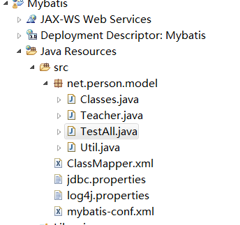
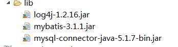

总操作流程：
- 1、[数据库](#java-01)
- 2、[model的Classes](#java-02)
- 3、[model的Teacher](#java-03)
- 4、[工具类Util](#java-04)
- 5、[ClassMapper.xml](#java-05)
- 6、[jdbc.properties](#java-06)
- 7、[log4j.properties](#java-07)
- 8、[mybatis-conf.xml](#java-08)

----------




## 数据库 <a name="java-01" href="#" >:house:</a>

<details>
<summary>代码</summary>

```sql
CREATE TABLE teacher(
	t_id INT PRIMARY KEY AUTO_INCREMENT, 
	t_name VARCHAR(20)
);
CREATE TABLE class(
	c_id INT PRIMARY KEY AUTO_INCREMENT, 
	c_name VARCHAR(20), 
	teacher_id INT
);
ALTER TABLE class ADD CONSTRAINT fk_teacher_id FOREIGN KEY (teacher_id) REFERENCES teacher(t_id);	

INSERT INTO teacher(t_name) VALUES('LS1');
INSERT INTO teacher(t_name) VALUES('LS2');

INSERT INTO class(c_name, teacher_id) VALUES('bj_a', 1);
INSERT INTO class(c_name, teacher_id) VALUES('bj_b', 2);

```

</details>

## model的Classes <a name="java-02" href="#" >:house:</a>

<details>
<summary>代码</summary>

```java
package net.person.model;

public class Classes {
	private int id;
	private String name;
	private Teacher teacher;
	
	public Classes(int id, String name, Teacher teacher) {
		super();
		this.id = id;
		this.name = name;
		this.teacher = teacher;
	}
	public Classes() {
		super();
	}
	public int getId() {
		return id;
	}
	public void setId(int id) {
		this.id = id;
	}
	public String getName() {
		return name;
	}
	public void setName(String name) {
		this.name = name;
	}
	public Teacher getTeacher() {
		return teacher;
	}
	public void setTeacher(Teacher teacher) {
		this.teacher = teacher;
	}
	
}

```

</details>

## model的Teacher <a name="java-03" href="#" >:house:</a>

<details>
<summary>代码</summary>

```java
package net.person.model;

public class Teacher {
	private int id;
	private String name;
	
	public Teacher() {
		super();
	}

	public Teacher(int id, String name) {
		super();
		this.id = id;
		this.name = name;
	}
	
	public int getId() {
		return id;
	}
	public void setId(int id) {
		this.id = id;
	}
	public String getName() {
		return name;
	}
	public void setName(String name) {
		this.name = name;
	}
	
	@Override
	public String toString() {
		return "Teacher [id=" + id + ", name=" + name + "]";
	}

}

```

</details>

## 工具类Util <a name="java-04" href="#" >:house:</a>

<details>
<summary>代码</summary>

```java
package net.person.model;

import java.io.InputStream;

import org.apache.ibatis.session.SqlSessionFactory;
import org.apache.ibatis.session.SqlSessionFactoryBuilder;

public class Util {
	public static SqlSessionFactory getFactory(){
		String resource = "mybatis-conf.xml"; 
		//加载mybatis的配置文件（它也加载关联的映射文件）
		InputStream is = Util.class.getClassLoader().getResourceAsStream(resource); 
		//构建sqlSession的工厂
		SqlSessionFactory factory = new SqlSessionFactoryBuilder().build(is);
		return factory;
	}
}

```

</details>

## ClassMapper.xml <a name="java-05" href="#" >:house:</a>

<details>
<summary>代码</summary>

```xml
<?xml version="1.0" encoding="UTF-8"?>
<!DOCTYPE mapper PUBLIC "-//mybatis.org//DTD Mapper 3.0//EN" "http://mybatis.org/dtd/mybatis-3-mapper.dtd"> 
<mapper namespace="classMapper">
	<!-- 
	方式一：嵌套结果：使用嵌套结果映射来处理重复的联合结果的子集
	         封装联表查询的数据(去除重复的数据)
	select * from class c, teacher t where c.teacher_id=t.t_id and  c.c_id=1
	-->
	<select id="getClass" parameterType="int" resultMap="getClassMap">
		SELECT * FROM class c,teacher t WHERE c.teacher_id=t.t_id AND c.c_id=#{id}
	</select>
	<resultMap type="Classes" id="getClassMap">
		<id property="id" column="c_id"/>
		<result property="name" column="c_name"/>
		<association property="teacher" javaType="Teacher">
			<id property="id" column="t_id"/>
			<result property="name" column="t_name"/>
		</association>
	</resultMap>

</mapper>
```

</details>

## jdbc.properties <a name="java-06" href="#" >:house:</a>
```sql
#mysql
jdbc.driver=com.mysql.jdbc.Driver
jdbc.url=jdbc:mysql://localhost:3306/mybatis
jdbc.username=root
jdbc.password=123456
```
## log4j.properties <a name="java-07" href="#" >:house:</a>

<details>
<summary>代码</summary>

```js
log4j.rootLogger=CONSOLE,FILE  
log4j.addivity.org.apache=true  
  
# 应用于控制台  
log4j.appender.CONSOLE=org.apache.log4j.ConsoleAppender  
log4j.appender.CONSOLE.Threshold=INFO  
log4j.appender.CONSOLE.Target=System.out  
log4j.appender.CONSOLE.Encoding=GBK
log4j.appender.CONSOLE.layout=org.apache.log4j.PatternLayout  
log4j.appender.CONSOLE.layout.ConversionPattern=[framework] %d - %c -%-4r [%t] %-5p %c %x - %m%n  
  
# 每天新建日志  
log4j.appender.A1=org.apache.log4j.DailyRollingFileAppender  
log4j.appender.A1.File=C:/log4j/log  
log4j.appender.A1.Encoding=GBK
log4j.appender.A1.Threshold=DEBUG  
log4j.appender.A1.DatePattern='.'yyyy-MM-dd  
log4j.appender.A1.layout=org.apache.log4j.PatternLayout  
log4j.appender.A1.layout.ConversionPattern=%d{ABSOLUTE} %5p %c{1}:%L : %m%n  
  
#应用于文件  
log4j.appender.FILE=org.apache.log4j.FileAppender  
log4j.appender.FILE.File=C:/log4j/file.log  
log4j.appender.FILE.Append=false  
log4j.appender.FILE.Encoding=GBK
log4j.appender.FILE.layout=org.apache.log4j.PatternLayout  
log4j.appender.FILE.layout.ConversionPattern=[framework] %d - %c -%-4r [%t] %-5p %c %x - %m%n  
  
# 应用于文件回滚  
log4j.appender.ROLLING_FILE=org.apache.log4j.RollingFileAppender  
log4j.appender.ROLLING_FILE.Threshold=ERROR  
log4j.appender.ROLLING_FILE.File=rolling.log  
log4j.appender.ROLLING_FILE.Append=true  
log4j.appender.CONSOLE_FILE.Encoding=GBK
log4j.appender.ROLLING_FILE.MaxFileSize=10KB  
log4j.appender.ROLLING_FILE.MaxBackupIndex=1  
log4j.appender.ROLLING_FILE.layout=org.apache.log4j.PatternLayout  
log4j.appender.ROLLING_FILE.layout.ConversionPattern=[framework] %d - %c -%-4r [%t] %-5p %c %x - %m%n  
  
#自定义Appender  
log4j.appender.im = net.cybercorlin.util.logger.appender.IMAppender  
log4j.appender.im.host = mail.cybercorlin.net  
log4j.appender.im.username = username  
log4j.appender.im.password = password  
log4j.appender.im.recipient = yyflyons@163.com  
log4j.appender.im.layout=org.apache.log4j.PatternLayout  
log4j.appender.im.layout.ConversionPattern =[framework] %d - %c -%-4r [%t] %-5p %c %x - %m%n  
  
#应用于socket  
log4j.appender.SOCKET=org.apache.log4j.RollingFileAppender  
log4j.appender.SOCKET.RemoteHost=localhost  
log4j.appender.SOCKET.Port=5001  
log4j.appender.SOCKET.LocationInfo=true  
# Set up for Log Facter 5  
log4j.appender.SOCKET.layout=org.apache.log4j.PatternLayout  
log4j.appender.SOCET.layout.ConversionPattern=[start]%d{DATE}[DATE]%n%p[PRIORITY]%n%x[NDC]%n%t[THREAD]%n%c[CATEGORY]%n%m[MESSAGE]%n%n  
# Log Factor 5 Appender  
log4j.appender.LF5_APPENDER=org.apache.log4j.lf5.LF5Appender  
log4j.appender.LF5_APPENDER.MaxNumberOfRecords=2000  
  
# 发送日志给邮件  
log4j.appender.MAIL=org.apache.log4j.net.SMTPAppender  
log4j.appender.MAIL.Threshold=FATAL  
log4j.appender.MAIL.BufferSize=10  
log4j.appender.MAIL.From=yyflyons@163.com  
log4j.appender.MAIL.SMTPHost=www.wusetu.com  
log4j.appender.MAIL.Subject=Log4J Message  
log4j.appender.MAIL.To=yyflyons@126.com  
log4j.appender.MAIL.layout=org.apache.log4j.PatternLayout  
log4j.appender.MAIL.layout.ConversionPattern=[framework] %d - %c -%-4r [%t] %-5p %c %x - %m%n  
# 打印出sql
log4j.logger.java.sql.Connection=DEBUG
log4j.logger.java.sql.ResultSet=DEBUG
log4j.logger.java.sql.PreparedStatement=DEBUG
log4j.logger.java.sql.Statement=DEBUG 

```

</details>

## mybatis-conf.xml <a name="java-08" href="#" >:house:</a>

<details>
<summary>代码</summary>

```xml
<?xml version="1.0" encoding="UTF-8"?>
<!DOCTYPE configuration PUBLIC "-//mybatis.org//DTD Config 3.0//EN" "http://mybatis.org/dtd/mybatis-3-config.dtd">
<configuration>
	<!-- 链接数据库配置文件 -->
	<properties resource="jdbc.properties"></properties>
	
	<!-- 配置实体类的别名 -->
	<typeAliases>
		<package name="net.person.model"/>
	</typeAliases>
	
	 <environments default="development">
        <environment id="development">
            <transactionManager type="JDBC" />
            <dataSource type="POOLED">
                <property name="driver" value="${jdbc.driver}" />
                <property name="url" value="${jdbc.url}" />
                <property name="username" value="${jdbc.username}" />
                <property name="password" value="${jdbc.password}" />
            </dataSource>
        </environment>
    </environments>
	
	<mappers>
		<mapper resource="ClassMapper.xml"/>
	</mappers>
	

</configuration>

```

</details>