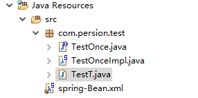
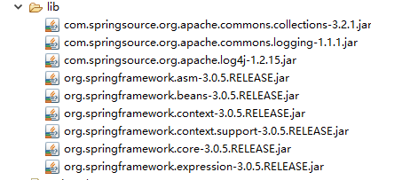
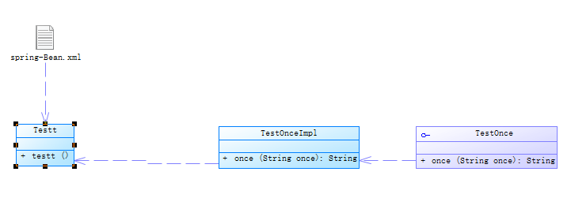
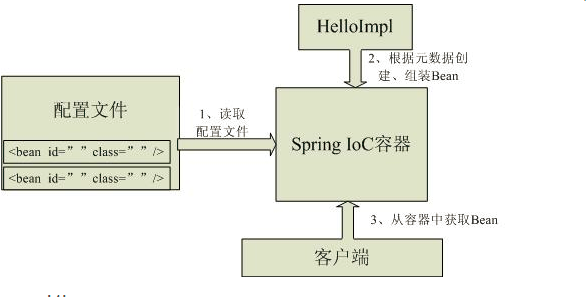
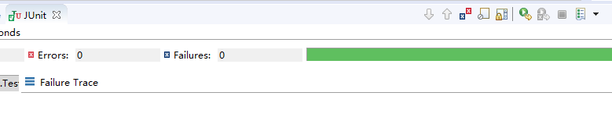

操作总流程：
- 1、[创建接口](#java-01)
- 2、[创建实现类](#java-02)
- 3、[创建实例化一个IOC容器](#java-03)
- 4、[创建bean配置](#java-04)

----------
- 项目结构：




下载地址：链接：http://pan.baidu.com/s/1i504qrF 密码：khuq

- 代码结构：



- 工作原理：


## 接口代码实现 <a name="java-01" href="#" >:house:</a>
```java
package com.persion.test;

public interface TestOnce {
	String once(String once);
}
```
## 实现类代码 <a name="java-02" href="#" >:house:</a>
```java
package com.persion.test;

public class TestOnceImpl implements TestOnce{

	@Override
	public String once(String once) {
		
		return "你好"+once;
	}

}
```
## 实例化一个IOC容器 <a name="java-03" href="#" >:house:</a>
```java
package com.persion.test;

import org.junit.Test;
import org.springframework.context.ApplicationContext;
import org.springframework.context.support.ClassPathXmlApplicationContext;
public class TestT {
	 	@Test
	    public void testt() {
	        // 1、读取配置文件实例化一个IOC容器
	        ApplicationContext context = new ClassPathXmlApplicationContext("spring-Bean.xml");
	        // 2、从容器中获取Bean，注意此处完全“面向接口编程，而不是面向实现”
	        TestOnce TO = context.getBean("TestOnce", TestOnce.class);
	        // 3、执行业务逻辑
	        System.out.println(TO.once("丽丽"));
	    }
}
```
## bean配置xml代码 <a name="java-04" href="#" >:house:</a>
```xml
<?xml version="1.0" encoding="UTF-8"?>
<beans xmlns="http://www.springframework.org/schema/beans"
	xmlns:xsi="http://www.w3.org/2001/XMLSchema-instance"
	xsi:schemaLocation="http://www.springframework.org/schema/beans http://www.springframework.org/schema/beans/spring-beans.xsd">
	 <!-- id 表示组件的名字，class表示组件类 -->
	<bean id="TestOnce" class="com.persion.test.TestOnceImpl"></bean>
</beans>
```
- 成功标识：

