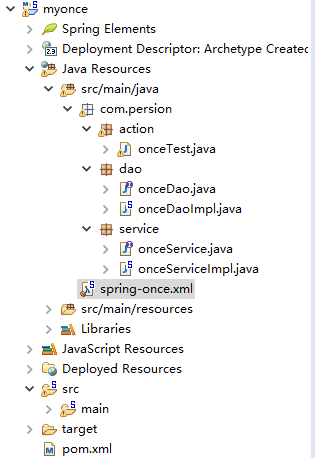
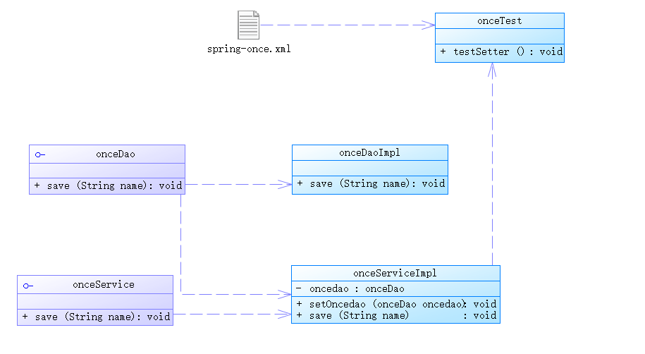

操作总流程
- 1、[创建Dao接口](#java-01)
- 2、[创建Dao实现类](#java-02)
- 3、[创建service接口](#java-03)
- 4、[创建service实现类](#java-04)
- 5、[创建xml配置文件](#java-05)
- 6、[添加依赖](#java-06)

----------
- 项目结构图



- 代码结构


## 创建Dao接口：onceTest <a name="java-01" href="#" >:house:</a>

<details>
<summary>代码</summary>

```java
package com.persion.action;

import org.junit.Test;
import org.junit.runner.RunWith;
import org.junit.runners.BlockJUnit4ClassRunner;
import org.springframework.context.ApplicationContext;
import org.springframework.context.support.ClassPathXmlApplicationContext;

import com.persion.service.onceService;

@RunWith(BlockJUnit4ClassRunner.class)
public class onceTest{
	@Test
	public void testSetter() {
		// 1、读取配置文件实例化一个IOC容器
        ApplicationContext context = new ClassPathXmlApplicationContext("spring-once.xml");
        // 2、从容器中获取Bean，注意此处完全“面向接口编程，而不是面向实现”
		onceService sevice=context.getBean("onceService", onceService.class);
		sevice.save("这是保存数据");
	}
}

```

</details>

## 创建Dao实现类：onceDao <a name="java-02" href="#" >:house:</a>
```java
package com.persion.dao;

public interface onceDao {
	public void save(String name);
}

```
## 创建service接口：onceDaoImpl <a name="java-03" href="#" >:house:</a>
```java
package com.persion.dao;

public class onceDaoImpl implements onceDao{

	public void save(String name) {
		//模拟数据库保存操作
		System.out.println("dao:"+name);
	}
	
}

```
## 创建service实现类：onceService <a name="java-04" href="#" >:house:</a>
```java
package com.persion.service;

public interface onceService {
	public void save(String name);
}

```
## onceServiceImpl <a name="java-05" href="#" >:house:</a>

<details>
<summary>代码</summary>

```java
package com.persion.service;

import com.persion.dao.onceDao;

public class onceServiceImpl implements onceService{
	private onceDao oncedao;
	
	//构造器注入
	public onceServiceImpl(onceDao oncedao) {
		this.oncedao = oncedao;
	}
	
	public void save(String name) {
		//模拟业务操作
		System.out.println("service:"+name);
		name = name+","+this.hashCode();
		oncedao.save(name);
	}

}
```

</details>

## 创建xml配置文件：spring-once.xml <a name="java-06" href="#" >:house:</a>

<details>
<summary>代码</summary>

```xml
<?xml version="1.0" encoding="UTF-8"?>
<beans xmlns="http://www.springframework.org/schema/beans"
	xmlns:xsi="http://www.w3.org/2001/XMLSchema-instance"
	xsi:schemaLocation="http://www.springframework.org/schema/beans
	http://www.springframework.org/schema/beans/spring-beans.xsd">
	
	<bean id="onceService" class="com.persion.service.onceServiceImpl">
		<constructor-arg name="oncedao" ref="onceDao"></constructor-arg>
	</bean>
	<bean id="onceDao" class="com.persion.dao.onceDaoImpl"></bean>

</beans>

```

</details>

## 添加依赖：pom.xml(依赖) <a name="java-07" href="#" >:house:</a>

<details>
<summary>代码</summary>

```xml
<project xmlns="http://maven.apache.org/POM/4.0.0" xmlns:xsi="http://www.w3.org/2001/XMLSchema-instance"
  xsi:schemaLocation="http://maven.apache.org/POM/4.0.0 http://maven.apache.org/maven-v4_0_0.xsd">
  <modelVersion>4.0.0</modelVersion>
  <groupId>com.persion.mytest</groupId>
  <artifactId>myocne</artifactId>
  <packaging>war</packaging>
  <version>0.0.1-SNAPSHOT</version>
  <name>myocne Maven Webapp</name>
  <url>http://maven.apache.org</url>
  <dependencies>
    <dependency>
	    <groupId>junit</groupId>
	    <artifactId>junit</artifactId>
	    <version>4.12</version>
	    <scope>test</scope>
	</dependency>
    <dependency>
	    <groupId>javax.servlet</groupId>
	    <artifactId>javax.servlet-api</artifactId>
	    <version>4.0.0</version>
	    <scope>provided</scope>
	</dependency>
	<!-- https://mvnrepository.com/artifact/org.springframework/spring-context -->
	<dependency>
	    <groupId>org.springframework</groupId>
	    <artifactId>spring-context</artifactId>
	    <version>4.3.11.RELEASE</version>
	</dependency>
	
	
  </dependencies>
  <build>
    <finalName>myocne</finalName>
  </build>
</project>
```

</details>