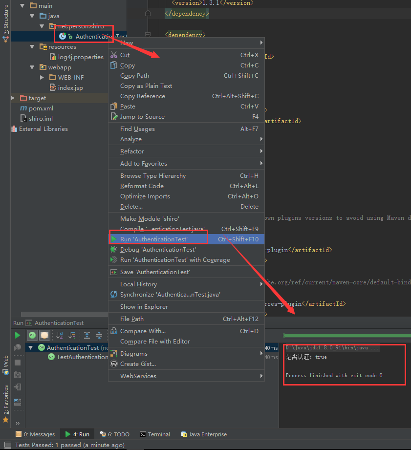

[](https://www.imooc.com/video/16954)


总操作流程：
- 1、[pom.xml引用包](#java-01)
- 2、[创建文件](#java-02)
- 3、[测试](#java-03)

***

## pom.xml引用包 <a name="java-01" href="#" >:house:</a>

<details>
<summary>代码</summary>

```xml
    <dependency>
      <groupId>junit</groupId>
      <artifactId>junit</artifactId>
      <version>4.12</version>
    </dependency>

    <dependency>
      <groupId>org.apache.shiro</groupId>
      <artifactId>shiro-core</artifactId>
      <version>1.3.1</version>
    </dependency>

    <dependency>
      <groupId>log4j</groupId>
      <artifactId>log4j</artifactId>
      <version>1.2.17</version>
    </dependency>

    <dependency>
      <groupId>org.slf4j</groupId>
      <artifactId>slf4j-log4j12</artifactId>
      <version>1.7.25</version>
      <scope>test</scope>
    </dependency>
```

</details>

## 创建文件 <a name="java-02" href="#" >:house:</a>

 - java

<details>
<summary>代码</summary>

```java
import org.apache.shiro.SecurityUtils;
import org.apache.shiro.authc.UsernamePasswordToken;
import org.apache.shiro.mgt.DefaultSecurityManager;
import org.apache.shiro.realm.text.IniRealm;
import org.apache.shiro.subject.Subject;
import org.junit.Test;

/**
 *eated by admin on 2018/6/18.
 */
public class JdbcRealm {

    @Test
    public void TestIniRealm(){
        IniRealm iniRealm=new IniRealm("classpath:use.ini");
        //1、创建SecurityManager环境
        DefaultSecurityManager defaultSecurityManager=new DefaultSecurityManager();
        defaultSecurityManager.setRealm(iniRealm);
        //2、主体提交认证请求
        SecurityUtils.setSecurityManager(defaultSecurityManager);
        Subject subject = SecurityUtils.getSubject();

        UsernamePasswordToken token = new UsernamePasswordToken("Mark","123456");//用户名，密码
        subject.login(token);
        System.out.println("是否认证："+subject.isAuthenticated());

        subject.checkRole("admin");
        subject.checkPermission("user:delete");
    }
}
```

</details>

- log4j.properties

<details>
<summary>代码</summary>

```js
# Configure logging for testing: optionally with log file
log4j.rootLogger=WARN, stdout
# log4j.rootLogger=WARN, stdout, logfile

log4j.appender.stdout=org.apache.log4j.ConsoleAppender
log4j.appender.stdout.layout=org.apache.log4j.PatternLayout
log4j.appender.stdout.layout.ConversionPattern=%d %p [%c] - %m%n

log4j.appender.logfile=org.apache.log4j.FileAppender
log4j.appender.logfile.File=target/spring.log
log4j.appender.logfile.layout=org.apache.log4j.PatternLayout
log4j.appender.logfile.layout.ConversionPattern=%d %p [%c] - %m%n
```

</details>

- use.ini
```js
[users]
Mark=123456,admin
[roles]
admin=user:delete
```

## 测试 <a name="java-03" href="#" >:house:</a>
